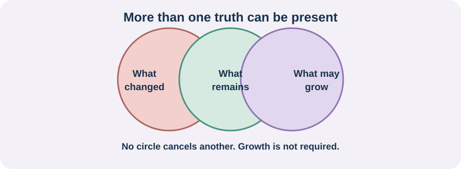

<!-- NAV-BREADCRUMB:START -->
[Home](../../../README.md) › [Course](../../README.md) › Part Five: Living With FND › [Module 18](README.md) › **Grief, Identity, Purpose, and Social Isolation**
<!-- NAV-BREADCRUMB:END -->

# Grief, Identity, Purpose, and Social Isolation

> **Working draft:** This page was automatically generated and is looking for [contributors and reviewers](https://fnd-education-project.github.io/FND-Education/).

FND may interrupt work, study, parenting, friendships, independence and plans. Grieving those changes does not mean you caused them or failed to adapt.

## For the Person With FND

### Definition

**Grief** is a response to loss. **Identity** is the changing story of who you are, including—but not limited to—illness, abilities, roles, relationships and values.

*Illustration: loss and growth can be present together. Growth is not required, and it does not cancel grief.*

### If you read only one thing

You are not only the life you can no longer perform. You also do not have to find a positive lesson in being ill.

### Grief does not move in a straight line

You may feel anger, numbness, relief at finally having a name, fear, envy, sadness or none of these. A better week can bring hope and a setback can reopen loss. There is no stage you must complete.

Purpose can be very small: caring for a pet, finishing a message, making something, learning, faith, humour or being present with someone. It should not become another demand to prove recovery.

Isolation may come from inaccessible places, unreliable capacity, communication difficulty, money, stigma or friends not knowing what to say. These are not all problems inside the individual. Qualitative FND research reports loss, isolation, mistrust, hope and purpose, while also showing wide variation. (*citations* [1](#citation-1), [2](#citation-2))

### Community experiences for review

**Option 1 — isolation in care**

> “I feel like we are on an island and none of these specialists seem to understand this disorder.”

— A parent's account after their daughter's diagnosis. [Read the public source](https://www.reddit.com/r/FND/comments/16iyjst/dad_helping_recently_diagnosed_daughter/).

**Option 2 — less fighting, more listening**

> “Listening to and understanding my body rather than fighting it to work seems to improve my symptoms the best.”

— One person's account of living with FND. [Read the public source](https://www.reddit.com/r/FND/comments/1sedrnt/does_anyone_actually_get_better/).

### Questions

#### What loss do you wish other people would acknowledge without trying to fix it?

#### What part of you is still yours, even when symptoms change what you can do?

### One small thing you can do

Finish one sentence: “Today, I am still someone who _____.” It can be as ordinary as “notices birds” or “cares about my friend.” Stop if the exercise feels false or painful.

If grief becomes unbearable, you feel unable to stay safe or you are thinking of suicide, seek urgent local crisis or emergency help. Psychological support can help with suffering; it does not mean FND is imagined or caused by your thoughts.

***
[For the Person With FND](#for-the-person-with-fnd) 
[For Family, Friends, and Other Supporters](#for-family-friends-and-other-supporters) 
[For Clinicians and the Care Team](#for-clinicians-and-the-care-team) 
[Research and Sources](#research-and-sources)
***

## For Family, Friends, and Other Supporters

Witnessing loss can help more than immediate encouragement. Try: “I can see how much that mattered.” Keep inviting the person in ways that allow cancellation, shorter visits, quiet space, mobility access or remote participation.

Do not demand gratitude, acceptance or optimism. Also do not assume a person has stopped caring because they cannot reply or attend reliably.

***
[For the Person With FND](#for-the-person-with-fnd) 
[For Family, Friends, and Other Supporters](#for-family-friends-and-other-supporters) 
[For Clinicians and the Care Team](#for-clinicians-and-the-care-team) 
[Research and Sources](#research-and-sources)
***

## For Clinicians and the Care Team

### Research quotations for review

**Option 1 — Szasz et al., 2025**

> “the burden and losses of the illness”

**Option 2 — Gatherer and Garip, 2025**

> “Finding meaning and purpose”

*Figure 1 — Research quotations offered for editorial selection. (*citations* [1](#citation-1), [2](#citation-2))*

### Ask about loss without inventing cause

Assess mood, anxiety, trauma when relevant, suicidality, isolation, role loss, finances, stigma, communication and access. Do not treat grief, distress or trauma as proof of why FND developed. Explore what the person wants supported now.

Offer psychological care for chosen goals such as grief, adjustment, anxiety or relationships, with the same consent and diagnostic care used elsewhere. Social work, occupational therapy, peer support and practical access may address burdens that therapy alone cannot. Small qualitative studies illuminate experience but do not establish a required route from grief to acceptance. (*citations* [1](#citation-1), [2](#citation-2))

***
[For the Person With FND](#for-the-person-with-fnd) 
[For Family, Friends, and Other Supporters](#for-family-friends-and-other-supporters) 
[For Clinicians and the Care Team](#for-clinicians-and-the-care-team) 
[Research and Sources](#research-and-sources)
***

<!-- NAV-CONTEXT:START -->
**Continue:** [Next page: Relationships, Intimacy, and Boundaries](02-relationships-intimacy-boundaries-and-supporter-wellbeing.md)

**Navigate:** [← Module overview](README.md) · [Course](../../README.md) · [Site Map](../../../SITEMAP.md)
<!-- NAV-CONTEXT:END -->

***

## Research and Sources

| Citation | Figure | Full citation |
|---|---|---|
| **[1]** | Figure 1 | Szasz A, Korner A, McLean L. Qualitative systematic review on the lived experience of functional neurological disorder (FND): an epistemological and ontological analysis. *BMJ Neurology Open*. 2025;7(1):e000694. [FND-CIT-0080](../../../research/citation-index.md#fnd-cit-0080). [https://doi.org/10.1136/bmjno-2024-000694](https://doi.org/10.1136/bmjno-2024-000694) |
| **[2]** | Figure 1 | Gatherer C, Garip G. “Look for Glimmers Instead of Triggers”: a qualitative exploration of the lived experiences of people with functional neurological disorder (FND). *Psychological Reports*. Published online June 15, 2025. [FND-CIT-0086](../../../research/citation-index.md#fnd-cit-0086). [https://doi.org/10.1177/00332941251351234](https://doi.org/10.1177/00332941251351234) |

This page still needs review by people with persistent or variable FND, grief specialists and suicide-safety reviewers.

*Plain-language draft and research package prepared: September 8, 2026 · Clinical review pending*
