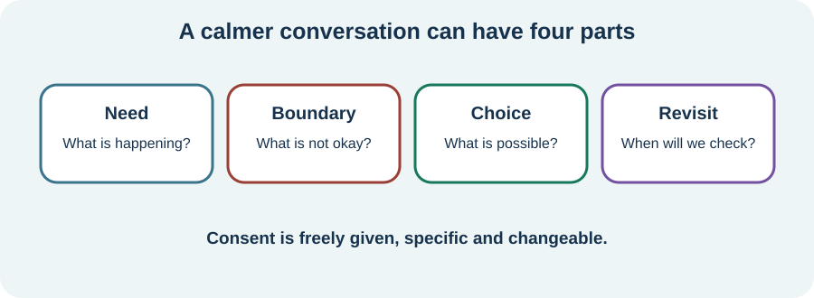

<!-- NAV-BREADCRUMB:START -->
[Home](../../../README.md) › [Course](../../README.md) › Part Five: Living With FND › [Module 18](README.md) › **Relationships, Intimacy, and Boundaries**
<!-- NAV-BREADCRUMB:END -->

# Relationships, Intimacy, and Boundaries

> **Working draft:** This page was automatically generated and is looking for [contributors and reviewers](https://fnd-education-project.github.io/FND-Education/).

Illness can change who does what, how people communicate and what closeness feels possible. Love does not remove the need for consent or boundaries.

## For the Person With FND

### Definition

A **boundary** says what a person is and is not willing or able to do. **Intimacy** can mean emotional or physical closeness; it is wider than sex.

*Illustration: a boundary can change with symptoms and circumstances. Consent must be freely given each time.*

### If you read only one thing

Needing care does not remove your privacy, adulthood or right to say yes, no, stop or not now.

### Make the hidden change speakable

Pain, fatigue, movement symptoms, numbness, episodes, medication, body image and fear of symptoms may affect touch or sex. Cognitive or speech symptoms may make a fast conversation impossible. A partner may shift between lover, friend and carer, sometimes without either person choosing it.

Try describing the present need rather than each other's character: “Noise is making it hard to find words; can we pause?” or “I want closeness, but not that kind of touch today.” No one is entitled to sexual contact. Dependence on practical help must never be used to pressure consent.

Research on relationships and intimacy across FND is limited. Qualitative work describes strain, isolation and the importance of relationships, but it cannot tell one couple what their relationship should look like. (*citations* [1](#citation-1), [2](#citation-2))

### Community experiences for review

**Option 1 — rebuilding communication**

> “We’ve had to completely overhaul our methods of communication ... working through these things has really helped my marriage evolve.”

**Option 2 — strain during mobility difficulty**

> “When I am walking, I am stress and in pain. My partner struggles to help me because I snap.”

— Two accounts of relationship change. [Read option 1](https://www.reddit.com/r/FND/comments/1g8ebg3/i_need_advice/) · [Read option 2](https://www.reddit.com/r/FND/comments/1dghzfz/people_with_experience_of_nhs_wheelchair_services/).

### Questions

#### What kind of closeness helps you feel like yourself rather than like a patient?

#### Which boundary is hardest to say when you need help from the same person?

### One small thing you can do

Choose a calm moment and finish: “When _____ happens, I need _____.” The other person may also name a need. Pause if the conversation becomes unsafe, coercive or too overwhelming.

***
[For the Person With FND](#for-the-person-with-fnd) 
[For Family, Friends, and Other Supporters](#for-family-friends-and-other-supporters) 
[For Clinicians and the Care Team](#for-clinicians-and-the-care-team) 
[Research and Sources](#research-and-sources)
***

## For Family, Friends, and Other Supporters

Ask before touching, moving, speaking for or helping with personal care. “I helped last time” is not consent this time. Keep affection and shared interests that are not about symptoms where both people want them.

Your needs and boundaries also matter. State them without making care conditional on obedience or making the person responsible for managing all of your feelings.

***
[For the Person With FND](#for-the-person-with-fnd) 
[For Family, Friends, and Other Supporters](#for-family-friends-and-other-supporters) 
[For Clinicians and the Care Team](#for-clinicians-and-the-care-team) 
[Research and Sources](#research-and-sources)
***

## For Clinicians and the Care Team

### Research quotations for review

**Option 1 — Szasz et al., 2025**

> “the importance of relatedness”

**Option 2 — Gatherer and Garip, 2025**

> “Navigating relationships with family and friends”

*Figure 1 — Research quotations offered for editorial selection. (*citations* [1](#citation-1), [2](#citation-2))*

### Ask without assumptions

Offer private, inclusive questions about roles, safety, intimacy, sexual function and consent when relevant. Do not assume relationship status, gender, sexuality, trauma history or that a supporter is safe. Seek permission before bringing a supporter into the conversation.

Consider pain, sensory loss, fatigue, autonomic symptoms, medication effects, pelvic health, mood, trauma-related needs and other diagnoses. Provide or refer for appropriate medical, sexual-health, pelvic-health, psychological or relationship support. Do not use couple conflict as a causal explanation of FND. The evidence base is mostly qualitative and small. (*citations* [1](#citation-1), [2](#citation-2))

***
[For the Person With FND](#for-the-person-with-fnd) 
[For Family, Friends, and Other Supporters](#for-family-friends-and-other-supporters) 
[For Clinicians and the Care Team](#for-clinicians-and-the-care-team) 
[Research and Sources](#research-and-sources)
***

<!-- NAV-CONTEXT:START -->
**Continue:** [Next page: Supporter Wellbeing and Shared Boundaries](03-supporter-wellbeing-and-shared-boundaries.md)

**Navigate:** [← Previous page](01-grief-identity-purpose-and-social-isolation.md) · [Module overview](README.md) · [Course](../../README.md)
<!-- NAV-CONTEXT:END -->

***

## Research and Sources

| Citation | Figure | Full citation |
|---|---|---|
| **[1]** | Figure 1 | Szasz A, Korner A, McLean L. Qualitative systematic review on the lived experience of functional neurological disorder (FND): an epistemological and ontological analysis. *BMJ Neurology Open*. 2025;7(1):e000694. [FND-CIT-0080](../../../research/citation-index.md#fnd-cit-0080). [https://doi.org/10.1136/bmjno-2024-000694](https://doi.org/10.1136/bmjno-2024-000694) |
| **[2]** | Figure 1 | Gatherer C, Garip G. “Look for Glimmers Instead of Triggers”: a qualitative exploration of the lived experiences of people with functional neurological disorder (FND). *Psychological Reports*. Published online June 15, 2025. [FND-CIT-0086](../../../research/citation-index.md#fnd-cit-0086). [https://doi.org/10.1177/00332941251351234](https://doi.org/10.1177/00332941251351234) |

This page still needs review by people with FND, partners, sexual-health clinicians, safeguarding specialists and relationship counsellors.

*Plain-language draft and research package prepared: September 8, 2026 · Clinical review pending*
