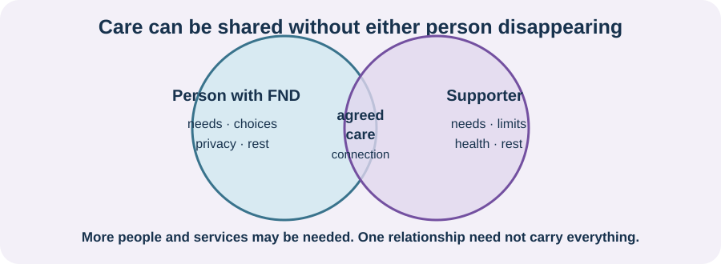

<!-- NAV-BREADCRUMB:START -->
[Home](../../../README.md) › [Course](../../README.md) › Part Five: Living With FND › [Module 18](README.md) › **Supporter Wellbeing and Shared Boundaries**
<!-- NAV-BREADCRUMB:END -->

# Supporter Wellbeing and Shared Boundaries

> **Working draft:** This page was automatically generated and is looking for [contributors and reviewers](https://fnd-education-project.github.io/FND-Education/).

FND affects a network of people, but the person with FND and the supporter do not have the same illness or the same responsibilities.

## For the Person With FND

### Definition

**Supporter wellbeing** means that the family member, friend or partner also has rest, information, health care, boundaries and a life beyond supporting. A **shared boundary** is an agreement about what each person can do and what needs another source of help.

*Illustration: care can be shared without either person disappearing. Not every need has to be met by one relationship.*

### If you read only one thing

A supporter needing rest does not mean you are a burden. It means the support arrangement needs enough people, resources and boundaries to be sustainable.

### Separate care from supervision

A supporter may help with transport, notes, meals, safety or personal care. They do not have to become your therapist or measure whether you are improving. You can agree what help is useful, what is private and what to do during an episode or difficult day.

Supporters may feel fear, grief, exhaustion or uncertainty. One very small functional-seizure study found high screening scores for anxiety or depression among caregivers, but it cannot describe all supporters or show that FND caused the distress. FND-specific care-partner research remains sparse. (*citations* [1](#citation-1), [2](#citation-2))

### Community experiences for review

**Option 1 — plan conflict outside conflict**

> “One thing that really helps us is discussing ground rules for conflict when we’re not actively IN it.”

— One person's relationship strategy. [Read the public source](https://www.reddit.com/r/FND/comments/1g8ebg3/i_need_advice/).

**Option 2 — agreed episode help**

> “During seizures he makes sure I am safe and not about to smack into something or fall.”

— One person's description of a partner's safety role. [Read the public source](https://www.reddit.com/r/FND/comments/1k8is0m/support_for_my_wife/).

### Questions

#### Which kind of help makes you feel supported, and which kind makes you feel watched?

#### What would make it easier for both you and your supporter to say, “We need more help”?

### One small thing you can do

Agree one sentence for a difficult moment, such as: “Please sit nearby but do not ask questions yet.” Write one boundary for each person. If care is unsafe or either person feels threatened, seek outside professional or safeguarding help.

***
[For the Person With FND](#for-the-person-with-fnd) 
[For Family, Friends, and Other Supporters](#for-family-friends-and-other-supporters) 
[For Clinicians and the Care Team](#for-clinicians-and-the-care-team) 
[Research and Sources](#research-and-sources)
***

## For Family, Friends, and Other Supporters

You may love the person and still be unable to provide every kind of care. Be specific: “I can drive on Tuesday, but I cannot lift you safely.” Ask clinicians for training and a written safety plan when the person consents.

Keep your own medical care, sleep, relationships and time where possible. Seek support for your distress without making the person with FND the only place you can put it. In an emergency or unsafe situation, get appropriate outside help.

***
[For the Person With FND](#for-the-person-with-fnd) 
[For Family, Friends, and Other Supporters](#for-family-friends-and-other-supporters) 
[For Clinicians and the Care Team](#for-clinicians-and-the-care-team) 
[Research and Sources](#research-and-sources)
***

## For Clinicians and the Care Team

### Research quotations for review

**Option 1 — Tsamakis et al., 2023**

> “high rates of anxiety and depression”

**Option 2 — Leochico et al., 2026**

> “persons with FND and their care partners”

*Figure 1 — Research quotations offered for editorial selection. (*citations* [1](#citation-1), [2](#citation-2))*

### Include supporters without displacing the patient

With consent, ask what the supporter actually does, what training they have, what feels unsafe and what respite or practical help exists. Speak to the person with FND directly and preserve private consultation time. Do not recruit relatives as unpaid therapists or adherence monitors.

Care-partner evidence in FND is very limited: the functional-seizure survey had 29 pairs, and the 2026 Ontario focus groups included only two care partners. Use these studies to justify asking, not to assume burden or prescribe one family arrangement. Address lifting, episode response, sleep, finances, safeguarding and access to social or caregiver services according to need. (*citations* [1](#citation-1), [2](#citation-2))

***
[For the Person With FND](#for-the-person-with-fnd) 
[For Family, Friends, and Other Supporters](#for-family-friends-and-other-supporters) 
[For Clinicians and the Care Team](#for-clinicians-and-the-care-team) 
[Research and Sources](#research-and-sources)
***

<!-- NAV-CONTEXT:START -->
**Continue:** [Next module: Healthcare Communication and Self-Advocacy](../module-19-healthcare-communication-and-self-advocacy/README.md)

**Navigate:** [← Previous page](02-relationships-intimacy-boundaries-and-supporter-wellbeing.md) · [Module overview](README.md) · [Course](../../README.md)
<!-- NAV-CONTEXT:END -->

***

## Research and Sources

| Citation | Figure | Full citation |
|---|---|---|
| **[1]** | Figure 1 | Tsamakis K, Papatriantafyllou E, Karavasilis E, et al. Depression and anxiety in caregivers of patients with functional seizures. *Epileptic Disorders*. 2023;25(2):200–207. [FND-CIT-0087](../../../research/citation-index.md#fnd-cit-0087). [https://doi.org/10.1002/epd2.20014](https://doi.org/10.1002/epd2.20014) |
| **[2]** | Figure 1 | Leochico CFG, Speck ER, Mikaelian S, et al. Challenges and care recommendations of persons with functional neurological disorder and care partners: a qualitative study. *Canadian Journal of Neurological Sciences*. Published online July 23, 2026:1–12. [FND-CIT-0082](../../../research/citation-index.md#fnd-cit-0082). [https://doi.org/10.1017/cjn.2026.10629](https://doi.org/10.1017/cjn.2026.10629) |

This page still needs review by people with FND, unpaid supporters, carer organisations, social workers and safeguarding specialists.

*Plain-language draft and research package prepared: September 8, 2026 · Clinical review pending*
