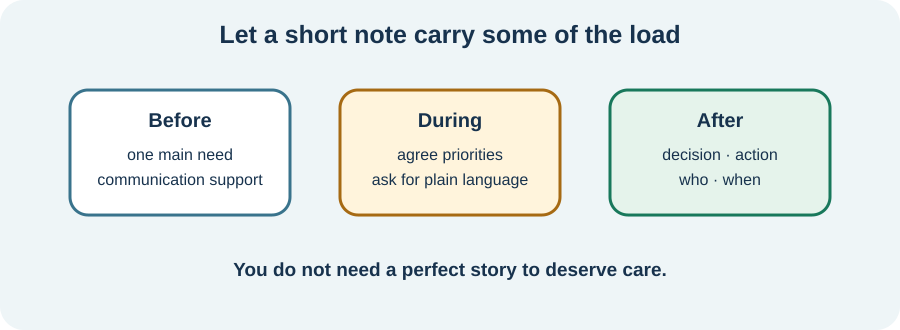

<!-- NAV-BREADCRUMB:START -->
[Home](../../../README.md) › [Course](../../README.md) › Part Five: Living With FND › [Module 19](README.md) › **Prepare for and Communicate During Appointments**
<!-- NAV-BREADCRUMB:END -->

# Prepare for and Communicate During Appointments

> **Working draft:** This page was automatically generated and is looking for [contributors and reviewers](https://fnd-education-project.github.io/FND-Education/).

Appointments ask for memory, speech, timing, travel and concentration—exactly the things that may be difficult. A short note can carry some of that load.

## For the Person With FND

### Definition

An **appointment summary** is a one-page or shorter note containing the information most needed for this visit. It is not your entire medical history.

*Illustration: preparation is support, not a test. You can use only the part that helps.*

### If you read only one thing

Put your main reason for coming near the top. You do not have to tell everything in perfect order to deserve care.

### A small structure

Before the visit, write:

1. **Today I most need help with:** one problem or decision.
2. **What is new or different:** include when it changed and any safety concern.
3. **What helps communication:** more time, written questions, quiet, a break or a support person.

During the visit, you can say, “I may lose words or memory. Please write the plan.” Ask what is known, what remains uncertain and what happens next. Afterward, add only the agreed action and who is responsible.

Research suggests that clear, empathic explanations repeated over time may improve understanding or satisfaction, but evidence that one communication method changes recovery is weak. Good communication is still part of respectful care. (*citation* [1](#citation-1))

### Community experiences for review

**Option 1 — bring support**

> “don’t be afraid to have a family member or friend to support you”

— One person's appointment advice. [Read the public source](https://www.reddit.com/r/FND/comments/1vdyjnt/i_cant_walk_or_take_care_of_basic_needs_and/).

**Option 2 — too little explanation**

> “I was told next to nothing, given no expectations”

— One person's account of diagnosis and follow-up. [Read the public source](https://www.reddit.com/r/FND/comments/1c35psh/tips_for_navigating_the_nhs/).

### Questions

#### What do you most need the clinician to understand about your life, not only your symptoms?

#### What happens to your thinking or speech in appointments, and what would make that easier?

### One small thing you can do

Write only: “Today I need help with _____.” If that is all you can prepare, it is enough. New or urgent symptoms still need appropriate assessment rather than being folded automatically into FND.

***
[For the Person With FND](#for-the-person-with-fnd) 
[For Family, Friends, and Other Supporters](#for-family-friends-and-other-supporters) 
[For Clinicians and the Care Team](#for-clinicians-and-the-care-team) 
[Research and Sources](#research-and-sources)
***

## For Family, Friends, and Other Supporters

Before the visit, agree your role: transport, notes, remembering a timeline, emotional support or speaking only when invited. During the visit, do not answer every question first. Help the person ask for a pause and check that the written plan matches what they heard.

***
[For the Person With FND](#for-the-person-with-fnd) 
[For Family, Friends, and Other Supporters](#for-family-friends-and-other-supporters) 
[For Clinicians and the Care Team](#for-clinicians-and-the-care-team) 
[Research and Sources](#research-and-sources)
***

## For Clinicians and the Care Team

### Research quotations for review

**Option 1 — Silva and Silva, 2026**

> “clearly, empathically, and with reinforcement over time”

**Option 2 — Leochico et al., 2026**

> “forced to self-advocate”

*Figure 1 — Research quotations offered for editorial selection. (*citations* [1](#citation-1), [2](#citation-2))*

### Reduce the communication burden

Ask the patient's priority, acknowledge the symptoms as real, explain the positive basis of an FND diagnosis and state what has and has not been assessed. Use ordinary language, short sections and teach-back: “What will you tell someone at home about today's plan?” Offer written information and follow-up clarification.

Communication access may require extra processing time, quiet, alternative communication or a supporter chosen by the patient. Do not mistake word-finding, dissociation, fatigue or distress for lack of credibility. The diagnostic-communication literature is heterogeneous and mostly not comparative; do not promise that acceptance of an explanation will itself produce recovery. (*citations* [1](#citation-1), [2](#citation-2))

***
[For the Person With FND](#for-the-person-with-fnd) 
[For Family, Friends, and Other Supporters](#for-family-friends-and-other-supporters) 
[For Clinicians and the Care Team](#for-clinicians-and-the-care-team) 
[Research and Sources](#research-and-sources)
***

<!-- NAV-CONTEXT:START -->
**Continue:** [Next page: Records, Written Plans, and Follow-Up](02-records-written-plans-second-opinions-and-follow-up.md)

**Navigate:** [← Module overview](README.md) · [Course](../../README.md) · [Site Map](../../../SITEMAP.md)
<!-- NAV-CONTEXT:END -->

***

## Research and Sources

| Citation | Figure | Full citation |
|---|---|---|
| **[1]** | Figure 1 | Silva AF, Silva B. Diagnostic communication in functional neurological disorder: a systematic review and meta-analysis of patient acceptance and clinical outcomes. *Patient Education and Counseling*. 2026;152:109826. [FND-CIT-0083](../../../research/citation-index.md#fnd-cit-0083). [https://doi.org/10.1016/j.pec.2026.109826](https://doi.org/10.1016/j.pec.2026.109826) |
| **[2]** | Figure 1 | Leochico CFG, Speck ER, Mikaelian S, et al. Challenges and care recommendations of persons with functional neurological disorder and care partners: a qualitative study. *Canadian Journal of Neurological Sciences*. Published online July 23, 2026:1–12. [FND-CIT-0082](../../../research/citation-index.md#fnd-cit-0082). [https://doi.org/10.1017/cjn.2026.10629](https://doi.org/10.1017/cjn.2026.10629) |

This page still needs review by people with cognitive or communication symptoms, clinicians and appointment-accessibility specialists.

*Plain-language draft and research package prepared: September 8, 2026 · Clinical review pending*
