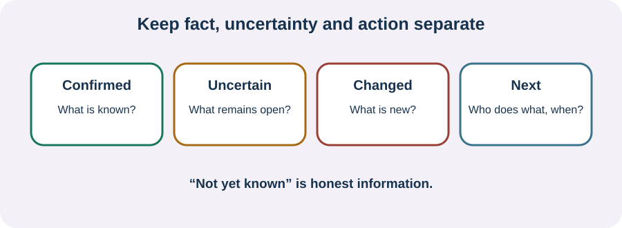

<!-- NAV-BREADCRUMB:START -->
[Home](../../../README.md) › [Course](../../README.md) › Part Five: Living With FND › [Module 19](README.md) › **Records, Written Plans, and Follow-Up**
<!-- NAV-BREADCRUMB:END -->

# Records, Written Plans, and Follow-Up

> **Working draft:** This page was automatically generated and is looking for [contributors and reviewers](https://fnd-education-project.github.io/FND-Education/).

A written plan gives memory somewhere outside your head. A clear record also makes it easier to notice when fact, uncertainty and opinion have been mixed together.

## For the Person With FND

### Definition

A **written care plan** records what was agreed, who will do it and when it will be reviewed. A **second opinion** is another qualified clinician's assessment; it is not a guarantee of a different diagnosis or treatment.

*Illustration: “not yet known” belongs in the record. It does not have to be disguised as certainty.*

### If you read only one thing

Ask for the next step in writing. If the record is wrong, name the exact sentence and the correction or context you want added.

### Keep four things separate

- **Confirmed:** diagnoses, positive signs, test results or observed events.
- **Uncertain:** questions still open and what would lead to reassessment.
- **Changed:** new symptoms, function, medicine, circumstances or safety concerns.
- **Next:** action, responsible person and expected timing.

Records often have local amendment or comment processes. Rules differ by health system and jurisdiction. You can ask how to request correction of a factual error or add your statement. A second opinion may be useful when the basis of diagnosis is unclear, a major decision is unresolved or trust has broken down, but access and referral rules vary.

Written information and opportunities for follow-up are recommended in FND communication research. They are supports for understanding, not tests of whether you “accept” the diagnosis correctly. (*citations* [1](#citation-1), [2](#citation-2))

### Community experiences for review

**Option 1 — time can be hard to place**

> “I can’t really tell the difference between whether something happened two weeks ago or four months ago.”

— One person's account of functional cognitive symptoms. [Read the public source](https://www.reddit.com/r/FND/comments/1mnw4fd/dae_have_functional_cognitive_disorder/).

**Option 2 — an individual plan**

> “we worked on an individualized treatment plan.”

— One person's account of rehabilitation. [Read the public source](https://www.reddit.com/r/FND/comments/11aerci/out_of_curiosity_have_any_of_you_actually_healed/).

### Questions

#### Which part of your health story is hardest to hold in memory or explain repeatedly?

#### What uncertainty would feel safer if it were written down honestly?

### One small thing you can do

After one visit, write three lines: **decision — next action — when to review**. If a record contains a factual error, copy the exact wording before contacting the service so you do not have to reconstruct it from memory.

***
[For the Person With FND](#for-the-person-with-fnd) 
[For Family, Friends, and Other Supporters](#for-family-friends-and-other-supporters) 
[For Clinicians and the Care Team](#for-clinicians-and-the-care-team) 
[Research and Sources](#research-and-sources)
***

## For Family, Friends, and Other Supporters

With permission, take notes in plain language. Mark your own observation as an observation rather than fact about what the person felt. Read back the plan and ask the person what they want followed up. Keep private information private.

***
[For the Person With FND](#for-the-person-with-fnd) 
[For Family, Friends, and Other Supporters](#for-family-friends-and-other-supporters) 
[For Clinicians and the Care Team](#for-clinicians-and-the-care-team) 
[Research and Sources](#research-and-sources)
***

## For Clinicians and the Care Team

### Research quotations for review

**Option 1 — Silva and Silva, 2026**

> “written informational resources”

**Option 2 — Pick et al., 2020**

> “few well-validated FND-specific outcome measures”

*Figure 1 — Research quotations offered for editorial selection. (*citations* [1](#citation-1), [2](#citation-2))*

### Write a plan another person can use

Document the positive basis for FND, meaningful differentials and comorbidities, the patient's priorities, agreed management, safety or reassessment triggers and named responsibility. Distinguish symptom report, examination, inference and unresolved uncertainty. Avoid copied stigmatizing formulations.

Record function across domains rather than using symptom count alone. Outcome-measure evidence in FND is limited, so a scale should not replace the person's account or define effort. Offer an accessible summary and a route for questions, factual corrections and follow-up. If a second opinion is sought, transfer relevant records without framing the request as non-compliance. (*citations* [1](#citation-1), [2](#citation-2))

***
[For the Person With FND](#for-the-person-with-fnd) 
[For Family, Friends, and Other Supporters](#for-family-friends-and-other-supporters) 
[For Clinicians and the Care Team](#for-clinicians-and-the-care-team) 
[Research and Sources](#research-and-sources)
***

<!-- NAV-CONTEXT:START -->
**Continue:** [Next page: When Healthcare Communication Breaks Down](03-when-healthcare-communication-breaks-down.md)

**Navigate:** [← Previous page](01-preparing-for-and-communicating-during-appointments.md) · [Module overview](README.md) · [Course](../../README.md)
<!-- NAV-CONTEXT:END -->

***

## Research and Sources

| Citation | Figure | Full citation |
|---|---|---|
| **[1]** | Figure 1 | Silva AF, Silva B. Diagnostic communication in functional neurological disorder: a systematic review and meta-analysis of patient acceptance and clinical outcomes. *Patient Education and Counseling*. 2026;152:109826. [FND-CIT-0083](../../../research/citation-index.md#fnd-cit-0083). [https://doi.org/10.1016/j.pec.2026.109826](https://doi.org/10.1016/j.pec.2026.109826) |
| **[2]** | Figure 1 | Pick S, Anderson DG, Asadi-Pooya AA, et al. Outcome measurement in functional neurological disorder: a systematic review and recommendations. *Journal of Neurology, Neurosurgery & Psychiatry*. 2020;91(6):638–649. [FND-CIT-0067](../../../research/citation-index.md#fnd-cit-0067). [https://doi.org/10.1136/jnnp-2019-322180](https://doi.org/10.1136/jnnp-2019-322180) |

This page still needs review by people who use records for memory access, health-record staff, clinicians and patient advocates.

*Plain-language draft and research package prepared: September 8, 2026 · Clinical review pending*
