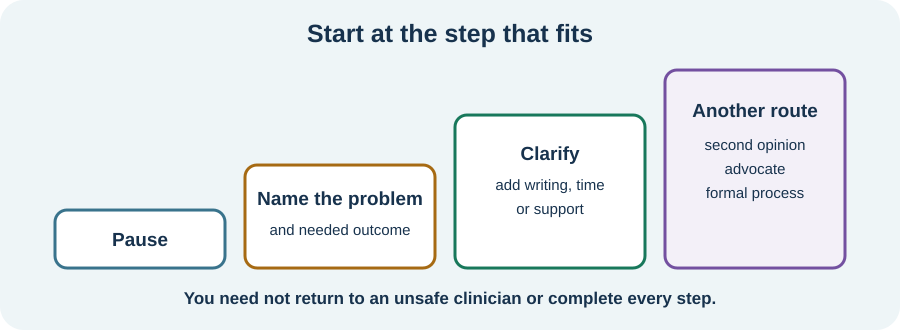

<!-- NAV-BREADCRUMB:START -->
[Home](../../../README.md) › [Course](../../README.md) › Part Five: Living With FND › [Module 19](README.md) › **When Healthcare Communication Breaks Down**
<!-- NAV-BREADCRUMB:END -->

# When Healthcare Communication Breaks Down

> **Working draft:** This page was automatically generated and is looking for [contributors and reviewers](https://fnd-education-project.github.io/FND-Education/).

Sometimes the problem is not that you need a better script. You may have been dismissed, stigmatized or left without a workable plan.

## For the Person With FND

### Definition

A **communication breakdown** happens when information, respect, consent or shared understanding is lost enough to affect care. **Repair** means naming the problem and trying a safer route forward; it does not require you to excuse harm.

*Illustration: start at the step that fits. You do not have to complete every step or return to an unsafe clinician.*

### If you read only one thing

You are allowed to say, “I do not understand the basis for that conclusion,” “That is not what I consented to,” or “I need this concern assessed rather than assumed to be FND.”

### Choose a proportionate next step

If it feels safe, ask for the statement in plain language or writing. Name the effect: “When all new symptoms are called FND, I do not know what change should bring me back.” Bring a supporter, advocate or communication aid if you want.

You may ask about another clinician, a second opinion, a patient liaison or a complaint process. Names, rights and routes vary by service and jurisdiction. Keep the exact dates, words, decisions and outcome you want. If care is urgent, use the appropriate urgent route rather than waiting for a complaint to resolve.

Research documents risks of diagnostic overshadowing, stigma and fragmented care. It also supports clear explanations and follow-up. It does not make every disagreement evidence of misconduct, and self-advocacy should not replace service responsibility. (*citations* [1](#citation-1), [2](#citation-2), [3](#citation-3))

### Community experiences for review

**Option 1 — not feeling safe or heard**

> “I did not feel safe or heard or understood at all.”

— One person's account of a clinical interaction. [Read the public source](https://www.reddit.com/r/FND/comments/1il1abc/it_hard_for_me_to_accept_that_fnd_is/).

**Option 2 — feeling alone in the system**

> “I feel like we are on an island and none of these specialists seem to understand this disorder.”

— A parent's account after their daughter's diagnosis. [Read the public source](https://www.reddit.com/r/FND/comments/16iyjst/dad_helping_recently_diagnosed_daughter/).

### Questions

#### What happened in care that you need someone to acknowledge clearly?

#### What would repair look like for you: an explanation, correction, apology, reassessment or another clinician?

### One small thing you can do

Write one sentence: **“The problem was _____, and I am asking for _____.”** Save copies. Ask an advocate or trusted person to help if the process is too much; inability to pursue a complaint does not make the experience less real.

***
[For the Person With FND](#for-the-person-with-fnd) 
[For Family, Friends, and Other Supporters](#for-family-friends-and-other-supporters) 
[For Clinicians and the Care Team](#for-clinicians-and-the-care-team) 
[Research and Sources](#research-and-sources)
***

## For Family, Friends, and Other Supporters

Ask whether the person wants witnessing, notes, help with a letter or no action yet. Do not take over the complaint or pressure them to return to a clinician they experience as unsafe. In a new appointment, offer a brief factual account rather than arguing the whole history unless invited.

***
[For the Person With FND](#for-the-person-with-fnd) 
[For Family, Friends, and Other Supporters](#for-family-friends-and-other-supporters) 
[For Clinicians and the Care Team](#for-clinicians-and-the-care-team) 
[Research and Sources](#research-and-sources)
***

## For Clinicians and the Care Team

### Research quotations for review

**Option 1 — Leochico et al., 2026**

> “misdiagnosed, dismissed”

**Option 2 — Mcloughlin et al., 2025**

> “iatrogenic harm”

*Figure 1 — Research quotations offered for editorial selection. (*citations* [1](#citation-1), [2](#citation-2))*

### Treat rupture as clinical information

Ask what the patient understood, what felt unsafe and what outcome they want. Correct factual errors, acknowledge uncertainty and apologize plainly where appropriate. Reassess new or changed symptoms proportionately; an established FND diagnosis neither prevents comorbidity nor requires indiscriminate testing.

Document diagnostic reasoning without pejorative shortcuts. Offer written explanation, follow-up, advocacy or another opinion according to need and local routes. Research on iatrogenic harm and qualitative care experience identifies real systemic risks, but does not supply a one-size repair process. (*citations* [1](#citation-1), [2](#citation-2), [3](#citation-3))

***
[For the Person With FND](#for-the-person-with-fnd) 
[For Family, Friends, and Other Supporters](#for-family-friends-and-other-supporters) 
[For Clinicians and the Care Team](#for-clinicians-and-the-care-team) 
[Research and Sources](#research-and-sources)
***

<!-- NAV-CONTEXT:START -->
**Continue:** [Next module: Work, Disability, and Community Participation](../module-20-work-disability-and-community-participation/README.md)

**Navigate:** [← Previous page](02-records-written-plans-second-opinions-and-follow-up.md) · [Module overview](README.md) · [Course](../../README.md)
<!-- NAV-CONTEXT:END -->

***

## Research and Sources

| Citation | Figure | Full citation |
|---|---|---|
| **[1]** | Figure 1 | Leochico CFG, Speck ER, Mikaelian S, et al. Challenges and care recommendations of persons with functional neurological disorder and care partners: a qualitative study. *Canadian Journal of Neurological Sciences*. Published online July 23, 2026:1–12. [FND-CIT-0082](../../../research/citation-index.md#fnd-cit-0082). [https://doi.org/10.1017/cjn.2026.10629](https://doi.org/10.1017/cjn.2026.10629) |
| **[2]** | Figure 1 | Mcloughlin C, Lee WH, Carson A, Stone J. Iatrogenic harm in functional neurological disorder. *Brain*. 2025;148(1):27–38. [FND-CIT-0069](../../../research/citation-index.md#fnd-cit-0069). [https://doi.org/10.1093/brain/awae283](https://doi.org/10.1093/brain/awae283) |
| **[3]** | — | Silva AF, Silva B. Diagnostic communication in functional neurological disorder: a systematic review and meta-analysis of patient acceptance and clinical outcomes. *Patient Education and Counseling*. 2026;152:109826. [FND-CIT-0083](../../../research/citation-index.md#fnd-cit-0083). [https://doi.org/10.1016/j.pec.2026.109826](https://doi.org/10.1016/j.pec.2026.109826) |

This page still needs review by people harmed or dismissed in care, clinicians, patient advocates, complaints staff and diagnostic-safety specialists.

*Plain-language draft and research package prepared: September 8, 2026 · Clinical review pending*
