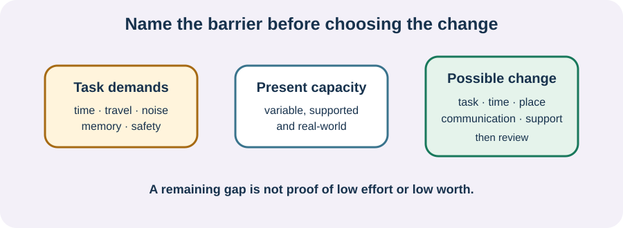

<!-- NAV-BREADCRUMB:START -->
[Home](../../../README.md) › [Course](../../README.md) › Part Five: Living With FND › [Module 20](README.md) › **Work, School, and Accommodations**
<!-- NAV-BREADCRUMB:END -->

# Work, School, and Accommodations

> **Working draft:** This page was automatically generated and is looking for [contributors and reviewers](https://fnd-education-project.github.io/FND-Education/).

The same job or class can contain many demands: travel, standing, screens, noise, memory, speed, attendance, safety and recovery afterward.

## For the Person With FND

### Definition

An **accommodation** is a change to a task, schedule, setting or way of communicating that reduces a disability-related barrier. Whether a change is legally required depends on the local law and setting.

*Illustration: the gap is information about the task and setting. It is not a measure of intelligence, effort or worth.*

### If you read only one thing

An accommodation may make work or study possible. If it does not, inability to continue is not personal failure. FND has no cure, and rehabilitation does not guarantee that someone can work.

### Name the barrier before the solution

Examples include flexible start time, predictable breaks, remote attendance, fewer simultaneous tasks, written instructions, reduced noise or light, an accessible route, seating, a communication method or adjusted attendance. A useful request connects the change to a function: “Because processing slows during episodes, I need written instructions and one task at a time.”

Sometimes no reasonable change makes the role safe, reliable or sustainable. Sick leave, reduced study, role change or stopping may be necessary. Rules for accommodations, disability status and benefits differ by jurisdiction; seek local advice rather than relying on this course as legal guidance.

Research shows work difficulty in selected FND groups, but it cannot predict an individual's capacity. One survey concerned self-selected people with functional seizures; a 2026 disability study came from one Australian tertiary clinic. A separate two-centre study found that participants often anticipated stigma at work, but it does not show that every workplace will respond badly. (*citations* [1](#citation-1), [2](#citation-2), [3](#citation-3))

### Community experiences for review

**Option 1 — familiar tasks becoming difficult**

> “Simple tasks I’ve done at work for years now demand major concentration ... I’ve been making many mistakes in my work.”

— One person's account of cognitive symptoms at work. [Read the public source](https://www.reddit.com/r/FND/comments/1czpbko/major_cognitive_issues_with_fnd/).

**Option 2 — reduced hours can still overwhelm**

> “I have gone from full-time hours ... to about 8 hours per week, and even this can be overwhelming and exhausting.”

— One person's account of trying to remain employed. [Read the public source](https://www.reddit.com/r/FND/comments/1mwf0wq/can_you_hold_a_job_with_fnd/).

### Questions

#### Which hidden demand of work or school costs you the most before or afterward?

#### What would you want others to understand if an accommodation still did not make attendance possible?

### One small thing you can do

Choose one task and finish: **“The barrier is _____; a change that might help is _____.”** If safety-critical work, driving, machinery, heights, water, lone work or episodes are involved, seek individualized occupational and medical advice.

***
[For the Person With FND](#for-the-person-with-fnd) 
[For Family, Friends, and Other Supporters](#for-family-friends-and-other-supporters) 
[For Clinicians and the Care Team](#for-clinicians-and-the-care-team) 
[Research and Sources](#research-and-sources)
***

## For Family, Friends, and Other Supporters

Do not use paid work as proof that the person is well, or unemployment as proof they have stopped trying. Help with one concrete task—forms, transport, a meeting note—if asked. Respect the person's decision about disclosure; employers or educators do not automatically need every medical detail.

***
[For the Person With FND](#for-the-person-with-fnd) 
[For Family, Friends, and Other Supporters](#for-family-friends-and-other-supporters) 
[For Clinicians and the Care Team](#for-clinicians-and-the-care-team) 
[Research and Sources](#research-and-sources)
***

## For Clinicians and the Care Team

### Research quotations for review

**Option 1 — Woodward et al., 2023**

> “work difficulties are common”

**Option 2 — Mcloughlin et al., 2026**

> “Anticipated stigma was experienced most from work”

*Figure 1 — Research quotations offered for editorial selection. (*citations* [1](#citation-1), [3](#citation-3))*

### Describe demands and function

Ask about the actual tasks, commute, schedule, cognitive and sensory load, safety, variability, recovery time and coexisting conditions. Separate capacity for a brief clinic task from reliable performance over a week. Document restrictions and possible changes without promising an employment result.

The functional-seizure survey was self-selected and cannot prescribe universal restrictions. The tertiary-clinic study shows substantial disability in a selected group, not that all people with FND cannot work. Support graded return when chosen and safe; also support leave, benefits and ongoing care when work is not possible. Employment is not a recovery outcome that overrides health, access or the person's priorities. (*citations* [1](#citation-1), [2](#citation-2), [3](#citation-3))

***
[For the Person With FND](#for-the-person-with-fnd) 
[For Family, Friends, and Other Supporters](#for-family-friends-and-other-supporters) 
[For Clinicians and the Care Team](#for-clinicians-and-the-care-team) 
[Research and Sources](#research-and-sources)
***

<!-- NAV-CONTEXT:START -->
**Continue:** [Next page: Community Participation and Meaningful Roles](02-community-participation-meaningful-roles-and-variable-capacity.md)

**Navigate:** [← Module overview](README.md) · [Course](../../README.md) · [Site Map](../../../SITEMAP.md)
<!-- NAV-CONTEXT:END -->

***

## Research and Sources

| Citation | Figure | Full citation |
|---|---|---|
| **[1]** | Figure 1 | Woodward J, Guler S, Balcer LJ, et al. Work difficulties, work restrictions, and disability benefits in people with functional seizures: a survey study. *Epilepsy & Behavior Reports*. 2023;23:100610. [FND-CIT-0084](../../../research/citation-index.md#fnd-cit-0084). [https://doi.org/10.1016/j.ebr.2023.100610](https://doi.org/10.1016/j.ebr.2023.100610) |
| **[2]** | — | Moss RSL, Lennon MJ, Anne S, et al. Disability, distress and delayed access to care in functional neurological disorder: cross-sectional study from an Australian tertiary clinic. *BJPsych Open*. 2026;12(3):e128. [FND-CIT-0090](../../../research/citation-index.md#fnd-cit-0090). [https://doi.org/10.1192/bjo.2026.11038](https://doi.org/10.1192/bjo.2026.11038) |
| **[3]** | Figure 1 | Mcloughlin C, Ludwig L, Carson A, Stone J. Stigma in functional neurological disorder: a longitudinal study. *Journal of Psychosomatic Research*. 2026;203:112550. [FND-CIT-0089](../../../research/citation-index.md#fnd-cit-0089). [https://doi.org/10.1016/j.jpsychores.2026.112550](https://doi.org/10.1016/j.jpsychores.2026.112550) |

This page still needs review by workers, students, people unable to work, occupational-health clinicians, educators and legal reviewers from multiple jurisdictions.

*Plain-language draft and research package prepared: September 8, 2026 · Clinical review pending*
