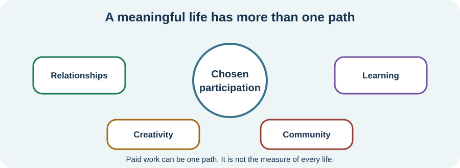

<!-- NAV-BREADCRUMB:START -->
[Home](../../../README.md) › [Course](../../README.md) › Part Five: Living With FND › [Module 20](README.md) › **Community Participation and Meaningful Roles**
<!-- NAV-BREADCRUMB:END -->

# Community Participation and Meaningful Roles

> **Working draft:** This page was automatically generated and is looking for [contributors and reviewers](https://fnd-education-project.github.io/FND-Education/).

Participation can mean belonging, choosing, learning, caring, creating or being present. It is not limited to paid work or visible productivity.

## For the Person With FND

### Definition

**Participation** means involvement in life situations that matter to you. A **meaningful role** is a place you hold in your own life or with others; it can be small, changing or unpaid.

*Illustration: no path is a ranking. Rest, receiving care and surviving a hard period do not make a person less valuable.*

### If you read only one thing

Your life does not have to wait until symptoms disappear. It also does not have to be turned into a rehabilitation exercise.

### Find the smallest version that still means something

Community may be one person, an online group, a faith community, a garden, a class, art, advocacy, parenting, gaming or caring for an animal. Access may mean joining for ten minutes, using a wheelchair, listening without speaking, leaving early or contributing from home.

The aim is not to fill every gap left by work or health. Some days there may be no available capacity. Severe or persistent FND can make participation very limited. Recurrence or worsening is not proof that someone did the activity incorrectly or did not try hard enough.

Qualitative studies report both isolation and the search for purpose, but small self-selected samples cannot define a good life for anyone else. (*citations* [1](#citation-1), [2](#citation-2))

### Community experiences for review

**Option 1 — an aid enabling life**

> “My mobility aids have been incredibly helpful and enable me to live life more fully.”

— One person's account of mobility aids and access. [Read the public source](https://www.reddit.com/r/FND/comments/106utzh/advice_needed_considering_using_mobility_aid_for/).

**Option 2 — support when recovery is not happening**

> “therapy has switched to helping [me] function as someone who is paralyzed”

— One person's account of changed rehabilitation goals. [Read the public source](https://www.reddit.com/r/FND/comments/1kchl1l/how_to_get_out_of_paralysis_epsiode/).

### Questions

#### Where do you feel known as a person rather than assessed as a patient?

#### What tiny version of a valued role would still feel real to you—not like a consolation prize?

### One small thing you can do

Choose one person or place and ask for one access change. A lower-demand version could be sending an emoji, listening for five minutes or asking for a recording. Doing nothing today is also allowed.

***
[For the Person With FND](#for-the-person-with-fnd) 
[For Family, Friends, and Other Supporters](#for-family-friends-and-other-supporters) 
[For Clinicians and the Care Team](#for-clinicians-and-the-care-team) 
[Research and Sources](#research-and-sources)
***

## For Family, Friends, and Other Supporters

Keep invitations open without making attendance a test. Offer the access details: quiet space, step-free route, flexible timing, transport, a place to lie down or permission to leave without apology. Ask what role the person wants instead of assigning only the role of care recipient.

***
[For the Person With FND](#for-the-person-with-fnd) 
[For Family, Friends, and Other Supporters](#for-family-friends-and-other-supporters) 
[For Clinicians and the Care Team](#for-clinicians-and-the-care-team) 
[Research and Sources](#research-and-sources)
***

## For Clinicians and the Care Team

### Research quotations for review

**Option 1 — Gatherer and Garip, 2025**

> “Finding meaning and purpose”

**Option 2 — Pritomanova et al., 2026**

> “hopes for the future”

*Figure 1 — Research quotations offered for editorial selection. (*citations* [1](#citation-1), [2](#citation-2))*

### Let the patient define participation

Ask what matters beyond symptom reduction and paid employment. Assess environmental, financial, cognitive, sensory, mobility and communication barriers. Occupational therapy, social work, peer support and accessible community services may help; do not prescribe volunteering or social activity as proof of motivation.

Research here is mainly qualitative and describes experience rather than intervention effects. A chosen role may support quality of life even if symptoms do not improve. When participation is severely limited, continue care for access, comfort, safety, relationships and supporter needs. There is no cure for FND, and a person's value is not contingent on rehabilitation gains. (*citations* [1](#citation-1), [2](#citation-2))

***
[For the Person With FND](#for-the-person-with-fnd) 
[For Family, Friends, and Other Supporters](#for-family-friends-and-other-supporters) 
[For Clinicians and the Care Team](#for-clinicians-and-the-care-team) 
[Research and Sources](#research-and-sources)
***

<!-- NAV-CONTEXT:START -->
**Continue:** [Next page: Describe Variable Function for Accommodations and Benefits](03-describing-variable-function-for-accommodations-and-benefits.md)

**Navigate:** [← Previous page](01-work-school-disability-and-accommodations.md) · [Module overview](README.md) · [Course](../../README.md)
<!-- NAV-CONTEXT:END -->

***

## Research and Sources

| Citation | Figure | Full citation |
|---|---|---|
| **[1]** | Figure 1 | Gatherer C, Garip G. “Look for Glimmers Instead of Triggers”: a qualitative exploration of the lived experiences of people with functional neurological disorder (FND). *Psychological Reports*. Published online June 15, 2025. [FND-CIT-0086](../../../research/citation-index.md#fnd-cit-0086). [https://doi.org/10.1177/00332941251351234](https://doi.org/10.1177/00332941251351234) |
| **[2]** | Figure 1 | Pritomanova I, et al. The journey to diagnosis and care of functional neurological disorder. *PLOS ONE*. 2026;21(4):e0328321. [FND-CIT-0088](../../../research/citation-index.md#fnd-cit-0088). [https://doi.org/10.1371/journal.pone.0328321](https://doi.org/10.1371/journal.pone.0328321) |

This page still needs review by people with severe or variable FND, disability communities, occupational therapists and community-access specialists.

*Plain-language draft and research package prepared: September 8, 2026 · Clinical review pending*
