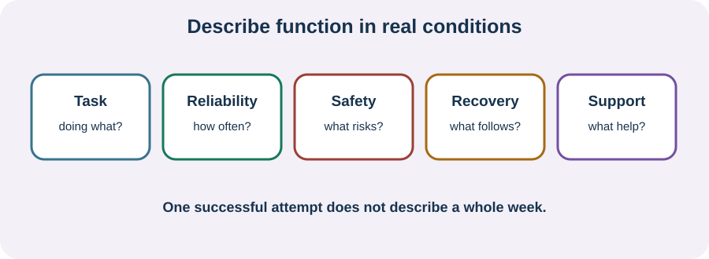

<!-- NAV-BREADCRUMB:START -->
[Home](../../../README.md) › [Course](../../README.md) › Part Five: Living With FND › [Module 20](README.md) › **Describe Variable Function for Accommodations and Benefits**
<!-- NAV-BREADCRUMB:END -->

# Describe Variable Function for Accommodations and Benefits

> **Working draft:** This page was automatically generated and is looking for [contributors and reviewers](https://fnd-education-project.github.io/FND-Education/).

“Can you do it?” can be the wrong question. You may do something once but not safely, repeatedly, on schedule or without a long recovery.

## For the Person With FND

### Definition

**Functional capacity** is what you can do in real conditions. **Variable function** means that ability changes across time or situations. Disability forms and rules use different definitions, so local advice matters.

*Illustration: one successful attempt does not answer every question about sustainable function.*

### If you read only one thing

Describe an ordinary week and a difficult week, not only your best day or worst moment. Include what happens during the task and afterward.

### Five parts of a useful example

1. **Task:** what you were trying to do.
2. **Reliability:** how often and predictably you can do it.
3. **Safety:** falls, episodes, mistakes, injury or supervision.
4. **Recovery:** what happens later and how long it lasts.
5. **Support:** prompting, equipment, transport, another person or changed conditions.

For example: “I can prepare a simple meal twice some weeks if ingredients are ready and someone is nearby. Standing and sequencing become unsafe on other days, and I may need to lie down afterward.” This is clearer than “I can cook” or “I cannot cook.”

Use records only as much as they help. A short dated example may be enough; constant monitoring can be burdensome. Benefit and accommodation systems differ, and this page is not legal advice.

Research shows that FND outcomes need more than a symptom score and that specialist samples can experience severe disability. Neither study can decide an individual claim. (*citations* [1](#citation-1), [2](#citation-2))

### Community experiences for review

**Option 1 — unstable walking**

> “My legs feel awful. They feel disconnected ... everything feels like I’m going to collapse.”

— One person's description of leg function. [Read the public source](https://www.reddit.com/r/FND/comments/10jxpsn/how_do_you_deal_with_leg_problems/).

**Option 2 — prompting for basic needs**

> “Currently I can barely take care of myself ... My partner has to remind me.”

— One person's account of memory and daily care. [Read the public source](https://www.reddit.com/r/FND/comments/13rzn9o/memory_issues/).

### Questions

#### Which thing can you sometimes do, but not reliably enough for other people to understand the problem?

#### What does the task cost you afterward that a form or appointment might miss?

### One small thing you can do

Write one example using only **task — reliability — safety — recovery — support**. Ask someone to help type or remember it if needed. Stop if recording symptoms is worsening distress or taking more capacity than it returns.

***
[For the Person With FND](#for-the-person-with-fnd) 
[For Family, Friends, and Other Supporters](#for-family-friends-and-other-supporters) 
[For Clinicians and the Care Team](#for-clinicians-and-the-care-team) 
[Research and Sources](#research-and-sources)
***

## For Family, Friends, and Other Supporters

With consent, add specific observations: the prompting given, the recovery you saw or why a task stopped. Do not exaggerate, minimize or turn a rare better day into the person's usual capacity. Let the person decide what private information is shared.

***
[For the Person With FND](#for-the-person-with-fnd) 
[For Family, Friends, and Other Supporters](#for-family-friends-and-other-supporters) 
[For Clinicians and the Care Team](#for-clinicians-and-the-care-team) 
[Research and Sources](#research-and-sources)
***

## For Clinicians and the Care Team

### Research quotations for review

**Option 1 — Pick et al., 2020**

> “few well-validated FND-specific outcome measures”

**Option 2 — Moss et al., 2026**

> “significant functional disability”

*Figure 1 — Research quotations offered for editorial selection. (*citations* [1](#citation-1), [2](#citation-2))*

### Describe, do not adjudicate beyond the evidence

Document diagnosis and comorbidities, but make the functional description task-specific: frequency, variability, quality, safety, time, assistance, adaptations and delayed effect. Distinguish patient report, supporter report, examination and inference. A short clinic examination cannot reproduce a full week or every work setting.

Outcome measures can support care but are imperfect and cover different domains. Specialist-cohort findings demonstrate possible severity, not an individual's eligibility. Avoid stating that fluctuating performance is inconsistency in the everyday sense or evidence of low effort. Give an opinion only within your role and local rules; record uncertainty plainly. (*citations* [1](#citation-1), [2](#citation-2))

***
[For the Person With FND](#for-the-person-with-fnd) 
[For Family, Friends, and Other Supporters](#for-family-friends-and-other-supporters) 
[For Clinicians and the Care Team](#for-clinicians-and-the-care-team) 
[Research and Sources](#research-and-sources)
***

<!-- NAV-CONTEXT:START -->
**Continue:** [Next part: Long-Term Management](../../part-6-long-term-management/module-21-setbacks-relapse-and-changing-symptoms/README.md)

**Navigate:** [← Previous page](02-community-participation-meaningful-roles-and-variable-capacity.md) · [Module overview](README.md) · [Course](../../README.md)
<!-- NAV-CONTEXT:END -->

***

## Research and Sources

| Citation | Figure | Full citation |
|---|---|---|
| **[1]** | Figure 1 | Pick S, Anderson DG, Asadi-Pooya AA, et al. Outcome measurement in functional neurological disorder: a systematic review and recommendations. *Journal of Neurology, Neurosurgery & Psychiatry*. 2020;91(6):638–649. [FND-CIT-0067](../../../research/citation-index.md#fnd-cit-0067). [https://doi.org/10.1136/jnnp-2019-322180](https://doi.org/10.1136/jnnp-2019-322180) |
| **[2]** | Figure 1 | Moss RSL, Lennon MJ, Anne S, et al. Disability, distress and delayed access to care in functional neurological disorder: cross-sectional study from an Australian tertiary clinic. *BJPsych Open*. 2026;12(3):e128. [FND-CIT-0090](../../../research/citation-index.md#fnd-cit-0090). [https://doi.org/10.1192/bjo.2026.11038](https://doi.org/10.1192/bjo.2026.11038) |

This page still needs review by people navigating disability systems, benefits advisers, clinicians, occupational therapists and legal reviewers from multiple jurisdictions.

*Plain-language draft and research package prepared: September 8, 2026 · Clinical review pending*
