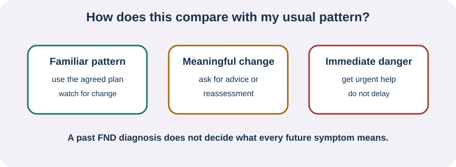

<!-- NAV-BREADCRUMB:START -->
[Home](../../../README.md) › [Course](../../README.md) › Part Six: Long-Term Management › [Module 21](README.md) › **Recognize a Setback Versus Medical Change**
<!-- NAV-BREADCRUMB:END -->

# Recognize a Setback Versus Medical Change

> **Working draft:** This page was automatically generated and is looking for [contributors and reviewers](https://fnd-education-project.github.io/FND-Education/).

The safest question is not “FND or emergency?” It is “How does this compare with my usual pattern, and what does my plan say?”

## For the Person With FND

### Definition

A **setback** is a period when familiar symptoms or difficulties return or worsen. A **medical change** is something new, substantially different, injured, severe or otherwise outside the plan you made with clinicians.

*Illustration: a familiar pattern may use the familiar plan; a meaningful change may need advice or reassessment; immediate danger needs urgent help.*

### If you read only one thing

FND can fluctuate, and one difficult day does not prove that every gain is gone. But an FND diagnosis does not protect you from injury, medication effects, infection, migraine or another condition. Compare the event with **your** usual pattern. Use the agreed plan when it still fits; seek appropriate help when it does not. (*citations* [1](#citation-1), [2](#citation-2))

### Three questions

1. **Is it familiar?** Compare the symptom, warning, length, recovery and help needed with what is usual for you.
2. **What is different?** Notice a new symptom, a major change in pattern, sustained decline, injury, illness, medication change or loss of a skill that is normally reliable.
3. **Is there immediate danger?** Use local emergency services for a possible emergency. Do not delay urgent care to finish a checklist.

Your own clinician-approved safety plan matters more than a general webpage. The same symptom can have different meanings in different people.

Researchers and clinical reviews warn against both under-investigating a new problem because “it is FND” and repeating burdensome or harmful treatment without considering a documented familiar pattern. There is no simple universal rule, and there is no cure for FND. (*citations* [1](#citation-1), [2](#citation-2), [3](#citation-3))

### Community experiences for review

**Option 1 — a new symptom after earlier improvement**

> “Since half a year I have a resting tremor in my hands. This tremor just came out of nowhere.”

— One person's report of a later symptom; it cannot establish its cause. [Read the public source](https://www.reddit.com/r/FND/comments/1dde4p6/my_journey_with_functional_neurological_disorder/).

**Option 2 — reassessment found another explanation**

> “He gave me steroid droplets ... and since then my light sensitivity is gone.”

— An eye clinician identified severe pollen allergy after the symptom had been attributed to FND. This is a reassessment example, not advice to use steroids. [Read the public source](https://www.reddit.com/r/FND/comments/1ievray/sharing_my_success_story/).

### Questions

#### When symptoms vary but still feel familiar, what helps you recognize your usual pattern?

#### What change would make you want reassessment instead of assuming it is FND?

### One small thing you can do

Write two lines: **“usual for me”** and **“different enough to get help.”** Add one example under each. Ask a clinician to review the second line when possible. A lower-demand version is to say the examples aloud while someone you trust writes them.

***
[For the Person With FND](#for-the-person-with-fnd) 
[For Family, Friends, and Other Supporters](#for-family-friends-and-other-supporters) 
[For Clinicians and the Care Team](#for-clinicians-and-the-care-team) 
[Research and Sources](#research-and-sources)
***

## For Family, Friends, and Other Supporters

Know where the plan is. During a familiar event, follow the person's agreed instructions and preserve privacy and dignity. During a changed event, describe what you actually observed: what began, when, what was different, possible injury and recovery.

Do not announce either “it is only FND” or “it must be an emergency” without considering the situation and the plan. If immediate safety is uncertain, seek appropriate help. Support does not require you to diagnose the event.

***
[For the Person With FND](#for-the-person-with-fnd) 
[For Family, Friends, and Other Supporters](#for-family-friends-and-other-supporters) 
[For Clinicians and the Care Team](#for-clinicians-and-the-care-team) 
[Research and Sources](#research-and-sources)
***

## For Clinicians and the Care Team

### Research quotations for review

**Option 1 — Finkelstein et al., 2021**

> “the presence of positive clinical signs of FND does not exclude the presence of a concomitant neurological condition.”

**Option 2 — Mcloughlin et al., 2025**

> “A balanced approach is needed not to over or under-investigate new symptoms on their own merits.”

*Figure 1 — Research quotations offered for editorial selection. (*citations* [1](#citation-1), [2](#citation-2))*

### Compare patterns without diagnostic overshadowing

Stabilize urgent problems first. Then compare the current event with documented semiology, baseline function and recovery. Record confirmed conditions, medication or illness changes, objective observations and what remains uncertain.

A previous FND diagnosis may explain a familiar recurrence but should not absorb every later symptom. Equally, repeated low-yield investigations or acute treatments can cause harm. Explain why reassessment is or is not indicated, give observable safety-netting and provide a route back if the pattern changes. (*citations* [1](#citation-1), [2](#citation-2))

***
[For the Person With FND](#for-the-person-with-fnd) 
[For Family, Friends, and Other Supporters](#for-family-friends-and-other-supporters) 
[For Clinicians and the Care Team](#for-clinicians-and-the-care-team) 
[Research and Sources](#research-and-sources)
***

<!-- NAV-CONTEXT:START -->
**Continue:** [Next page: Respond During a Setback](02-responding-recovering-and-updating-the-plan.md)

**Navigate:** [Module overview](README.md) · [Course](../../README.md) · [Site Map](../../../SITEMAP.md)
<!-- NAV-CONTEXT:END -->

***

## Research and Sources

These reviews support medical reassessment based on the current presentation while trying to reduce both diagnostic overshadowing and avoidable harm. They do not provide a personal emergency rule. (*citations* [1](#citation-1), [2](#citation-2), [3](#citation-3))

| Citation | Figure | Full citation |
|---|---|---|
| **[1]** | Figure 1 | Finkelstein SA, Cortel-LeBlanc MA, Cortel-LeBlanc A, Stone J. Functional neurological disorder in the emergency department. *Academic Emergency Medicine*. 2021;28(6):685–696. [FND-CIT-0068](../../../research/citation-index.md#fnd-cit-0068). [https://doi.org/10.1111/acem.14263](https://doi.org/10.1111/acem.14263) |
| **[2]** | Figure 1 | Mcloughlin C, Lee WH, Carson A, Stone J. Iatrogenic harm in functional neurological disorder. *Brain*. 2025;148(1):27–38. [FND-CIT-0069](../../../research/citation-index.md#fnd-cit-0069). [https://doi.org/10.1093/brain/awae283](https://doi.org/10.1093/brain/awae283) |
| **[3]** | — | Nicholson C, Edwards MJ, Carson AJ, et al. Occupational therapy consensus recommendations for functional neurological disorder. *Journal of Neurology, Neurosurgery & Psychiatry*. 2020;91(10):1037–1045. [FND-CIT-0011](../../../research/citation-index.md#fnd-cit-0011). [https://doi.org/10.1136/jnnp-2019-322281](https://doi.org/10.1136/jnnp-2019-322281) |

This page still needs review by emergency clinicians, neurologists, people with several diagnoses and people whose symptoms fluctuate.

*Plain-language draft and research package prepared: September 9, 2026 · Clinical review pending*
