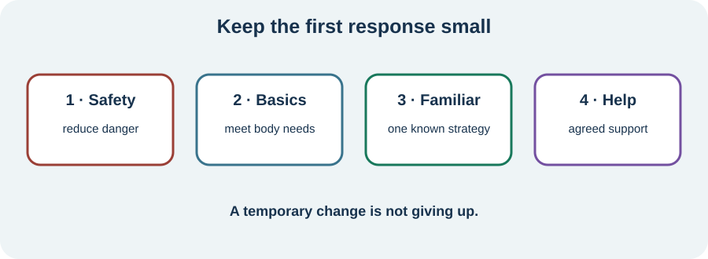

<!-- NAV-BREADCRUMB:START -->
[Home](../../../README.md) › [Course](../../README.md) › Part Six: Long-Term Management › [Module 21](README.md) › **Respond During a Setback**
<!-- NAV-BREADCRUMB:END -->

# Respond During a Setback

> **Working draft:** This page was automatically generated and is looking for [contributors and reviewers](https://fnd-education-project.github.io/FND-Education/).

When a familiar setback begins, the first job is not to explain it. The first job is to make the next part safer and more manageable.

## For the Person With FND

### Definition

A **setback response** is the small set of actions you use while familiar symptoms are worse. It can include safety, basic needs, a known strategy, temporary changes and help from another person.

*Illustration: start with safety and basic needs, then use one familiar strategy and agreed support rather than trying everything.*

### If you read only one thing

Use the simplest version of the plan that fits today. Reduce immediate risk. Meet basic needs where possible. Return to a strategy already agreed or safely tested. Pause, reduce or adapt activities that are currently unsafe. A temporary change is not giving up.

### A short response

1. **Safety:** move away from hazards; use the episode or fall plan if relevant.
2. **Basics:** consider medication as prescribed, fluids or food if safe, toileting, temperature, rest and a quieter place.
3. **One known strategy:** choose a cue, position, aid, communication method or calming practice that has helped before.
4. **Agreed help:** tell a supporter what you want them to do, or contact a clinician if the familiar plan is no longer enough.

Do not force movement, exposure, exercise or emotional processing through instability. Do not abruptly change prescribed medication without appropriate advice. If the presentation is new, severely changed or dangerous, use the medical-change guidance from the previous page.

Research about FND rehabilitation supports individual plans and self-management, but specific “relapse prevention” packages have not been tested well across all FND presentations. A setback may reflect several overlapping loads—or no clear cause. It is not proof that you failed to prevent it. (*citations* [1](#citation-1), [2](#citation-2))

### Community experiences for review

**Option 1 — the good-day surge**

> “I feel good, I’ll do it all—only to crash out later and feel awful.”

— One person's account of learning not to treat a better day as unlimited capacity. [Read the public source](https://www.reddit.com/r/FND/comments/1qlwz51/exercise_and_fnd/).

**Option 2 — boundaries and body signals**

> “It’s good to test out boundaries but listen to your body!!”

— Lived-experience advice, not a universal activity rule or a substitute for a safety plan. [Read the public source](https://www.reddit.com/r/FND/comments/1ipf4gt/is_this_really_the_only_way/).

### Questions

#### When things worsen, which one familiar action helps you feel safer or less overwhelmed?

#### What do you tend to push through because stopping feels like failure?

### One small thing you can do

Make a four-word prompt: **safe — basics — familiar — help**. Put it where you can find it. A lower-demand version is to ask a supporter to remember those four words. Stop and seek appropriate care when the event falls outside your plan.

***
[For the Person With FND](#for-the-person-with-fnd) 
[For Family, Friends, and Other Supporters](#for-family-friends-and-other-supporters) 
[For Clinicians and the Care Team](#for-clinicians-and-the-care-team) 
[Research and Sources](#research-and-sources)
***

## For Family, Friends, and Other Supporters

Ask one short question: “Do you want quiet, practical help, the written plan or medical help?” Use agreed cues. Reduce hazards and help with essentials without taking over choices that the person can still make.

Avoid searching for a cause during distress, testing the person's ability, demanding visible effort or turning rehabilitation into an emergency task. If the plan no longer fits, help obtain clinical advice. Your safety and capacity matter too.

***
[For the Person With FND](#for-the-person-with-fnd) 
[For Family, Friends, and Other Supporters](#for-family-friends-and-other-supporters) 
[For Clinicians and the Care Team](#for-clinicians-and-the-care-team) 
[Research and Sources](#research-and-sources)
***

## For Clinicians and the Care Team

### Research quotations for review

**Option 1 — Nicholson et al., 2020**

> “individualised assessment and treatment”

**Option 2 — Lehn et al., 2025**

> “person-centred treatment”

*Figure 1 — Research quotations offered for editorial selection. (*citations* [1](#citation-1), [2](#citation-2))*

### Agree the response before it is needed

Co-produce a brief plan that distinguishes familiar recurrence from reassessment triggers. Specify safe immediate actions, communication access, medication instructions within scope, temporary rehabilitation modification, supporter roles and follow-up responsibility.

Do not interpret worsening as poor motivation or prescribe automatic progression. Review injury, illness, medication effects and comorbid symptoms. Keep a route to symptom relief, accessibility and participation even when improvement is limited. The evidence here is mainly consensus and broad treatment guidance, not trials of one setback protocol. (*citations* [1](#citation-1), [2](#citation-2))

***
[For the Person With FND](#for-the-person-with-fnd) 
[For Family, Friends, and Other Supporters](#for-family-friends-and-other-supporters) 
[For Clinicians and the Care Team](#for-clinicians-and-the-care-team) 
[Research and Sources](#research-and-sources)
***

<!-- NAV-CONTEXT:START -->
**Continue:** [Next page: Recover, Review, and Update the Plan](03-recovering-reviewing-and-updating-the-plan.md)

**Navigate:** [← Previous page](01-recognizing-a-setback-versus-medical-change.md) · [Module overview](README.md) · [Course](../../README.md)
<!-- NAV-CONTEXT:END -->

***

## Research and Sources

These professional recommendations support individual, function-based planning. They do not show that one response prevents relapse or that a setback was preventable. (*citations* [1](#citation-1), [2](#citation-2))

| Citation | Figure | Full citation |
|---|---|---|
| **[1]** | Figure 1 | Nicholson C, Edwards MJ, Carson AJ, et al. Occupational therapy consensus recommendations for functional neurological disorder. *Journal of Neurology, Neurosurgery & Psychiatry*. 2020;91(10):1037–1045. [FND-CIT-0011](../../../research/citation-index.md#fnd-cit-0011). [https://doi.org/10.1136/jnnp-2019-322281](https://doi.org/10.1136/jnnp-2019-322281) |
| **[2]** | Figure 1 | Lehn A, Petrie D, Palmer D, et al. Managing functional neurological disorder: treatment recommendations for health professionals in Australia. *BMJ Neurology Open*. 2025;7(1):e000970. [FND-CIT-0076](../../../research/citation-index.md#fnd-cit-0076). [https://doi.org/10.1136/bmjno-2024-000970](https://doi.org/10.1136/bmjno-2024-000970) |

This page still needs review by people with recurrent or persistent symptoms, supporters, rehabilitation clinicians and emergency-care reviewers.

*Plain-language draft and research package prepared: September 9, 2026 · Clinical review pending*
