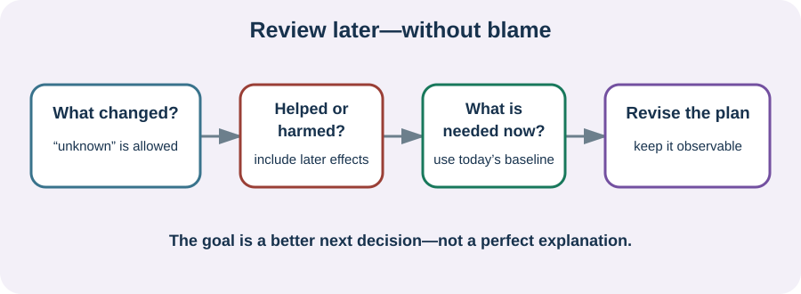

<!-- NAV-BREADCRUMB:START -->
[Home](../../../README.md) › [Course](../../README.md) › Part Six: Long-Term Management › [Module 21](README.md) › **Recover, Review, and Update the Plan**
<!-- NAV-BREADCRUMB:END -->

# Recover, Review, and Update the Plan

> **Working draft:** This page was automatically generated and is looking for [contributors and reviewers](https://fnd-education-project.github.io/FND-Education/).

A later review can make the next setback less confusing. It should not become an investigation into what you did wrong.

## For the Person With FND

### Definition

A **setback review** is a short look back after you are more stable. Its purpose is to keep, change or remove parts of the plan—not to prove one cause.

*Illustration: look at what changed and what helped or harmed, then update the plan for present needs.*

### If you read only one thing

You do not need a perfect explanation. Record only what could change a future decision. Recovery may mean returning to an earlier level, finding a new baseline, improving one part of life or making life safer while symptoms persist.

### Review without blame

Ask:

- **What was different?** Include illness, injury, medication, sleep, pain, activity, sensory or social load—but leave “unknown” available.
- **What helped, did nothing or caused harm?** Include the later effect, not only what happened during the activity.
- **What changed in daily life?** Note support, aids, communication, work, care tasks and recovery time.
- **What should the plan say next time?** Keep the answer short and observable.

Worsening, recurrence, slow recovery or a changed baseline does not measure effort. FND has no cure. Treatment may improve symptoms, function or quality of life for some people, but a person who remains disabled has not failed.

Do not rush back to a previous schedule because the calendar says enough time has passed. Re-enter activities in a way that fits current safety, capacity, goals and other health conditions. Research measures are limited, and group results cannot predict your outcome. (*citations* [1](#citation-1), [2](#citation-2), [3](#citation-3))

### Community experiences for review

**Option 1 — quality of life without a cure claim**

> “Therapy will not cure FND. Therapy can massively improve the quality of life for people like us.”

— One person's view; the kind and degree of benefit vary. [Read the public source](https://www.reddit.com/r/FND/comments/1eskwez/doctors_think_it_is_all_caused_by_stress_and/).

**Option 2 — harm from promised cure and blame**

> “I do mind the near guarantee of a cure and when it doesn’t work they blame you.”

— One person's response to “retraining” language. [Read the public source](https://www.reddit.com/r/FND/comments/1skxv3t/am_i_the_only_one_who_hates_the_phrase_retraining/).

### Questions

#### After your last difficult period, what did you learn that could make the next one safer or kinder?

#### Which expectation about “getting back to normal” is helping you, and which one is adding pressure?

### One small thing you can do

Complete one sentence: **“Next time, keep ___ and change ___.”** “I do not know yet” is a valid answer. If the setback involved injury, a new pattern or treatment harm, review it with an appropriate clinician.

***
[For the Person With FND](#for-the-person-with-fnd) 
[For Family, Friends, and Other Supporters](#for-family-friends-and-other-supporters) 
[For Clinicians and the Care Team](#for-clinicians-and-the-care-team) 
[Research and Sources](#research-and-sources)
***

## For Family, Friends, and Other Supporters

Wait until the person has enough capacity, then ask whether they want to review together. Offer observations as observations: “I noticed recovery took longer,” not “You caused this by…”

Review your role too. What help was wanted? What was unsustainable, unsafe or outside your role? A better plan can protect both people without making the supporter a monitor or clinician.

***
[For the Person With FND](#for-the-person-with-fnd) 
[For Family, Friends, and Other Supporters](#for-family-friends-and-other-supporters) 
[For Clinicians and the Care Team](#for-clinicians-and-the-care-team) 
[Research and Sources](#research-and-sources)
***

## For Clinicians and the Care Team

### Research quotations for review

**Option 1 — Pick et al., 2020**

> “few well-validated FND-specific outcome measures”

**Option 2 — Thomas et al., 2025**

> “did not negate meaningful gains”

*Figure 1 — Research quotations offered for editorial selection. (*citations* [2](#citation-2), [3](#citation-3))*

### Use the setback as information, not a verdict

Review current semiology, function, comorbidity, adverse effects, barriers, accessibility and the patient's priorities. Separate a plausible contributor from a proven cause. Decide together whether to resume, reduce, adapt, stop or reassess an intervention.

Use several outcome domains and record non-response or harm. Chronicity may be associated with some group-level differences, but it does not determine an individual's potential or entitlement to care. Continue symptom relief, safety, access, participation and review even when restoration is limited. (*citations* [1](#citation-1), [2](#citation-2), [3](#citation-3))

***
[For the Person With FND](#for-the-person-with-fnd) 
[For Family, Friends, and Other Supporters](#for-family-friends-and-other-supporters) 
[For Clinicians and the Care Team](#for-clinicians-and-the-care-team) 
[Research and Sources](#research-and-sources)
***

<!-- NAV-CONTEXT:START -->
**Continue:** [Next module: Build Your Personal FND Handbook](../module-22-building-your-personal-fnd-handbook/README.md)

**Navigate:** [← Previous page](02-responding-recovering-and-updating-the-plan.md) · [Module overview](README.md) · [Course](../../README.md)
<!-- NAV-CONTEXT:END -->

***

## Research and Sources

These sources support flexible goals and broader outcome review. The treatment meta-analysis describes group averages and cannot predict one person's course. (*citations* [1](#citation-1), [2](#citation-2), [3](#citation-3))

| Citation | Figure | Full citation |
|---|---|---|
| **[1]** | — | Nicholson C, Edwards MJ, Carson AJ, et al. Occupational therapy consensus recommendations for functional neurological disorder. *Journal of Neurology, Neurosurgery & Psychiatry*. 2020;91(10):1037–1045. [FND-CIT-0011](../../../research/citation-index.md#fnd-cit-0011). [https://doi.org/10.1136/jnnp-2019-322281](https://doi.org/10.1136/jnnp-2019-322281) |
| **[2]** | Figure 1 | Pick S, Anderson DG, Asadi-Pooya AA, et al. Outcome measurement in functional neurological disorder: a systematic review and recommendations. *Journal of Neurology, Neurosurgery & Psychiatry*. 2020;91(6):638–649. [FND-CIT-0067](../../../research/citation-index.md#fnd-cit-0067). [https://doi.org/10.1136/jnnp-2019-322180](https://doi.org/10.1136/jnnp-2019-322180) |
| **[3]** | Figure 1 | Thomas ST, Thomas ET, Schembri E, Lehn AC, Palmer DDG. Treatment outcomes in functional neurological disorder: a systematic review and meta-analysis exploring the influence of symptom chronicity. *BMJ Neurology Open*. 2025;7(2):e001150. [FND-CIT-0051](../../../research/citation-index.md#fnd-cit-0051). [https://doi.org/10.1136/bmjno-2025-001150](https://doi.org/10.1136/bmjno-2025-001150) |

This page still needs review by people with persistent or recurrent FND, supporters and clinicians who provide long-term care.

*Plain-language draft and research package prepared: September 9, 2026 · Clinical review pending*
