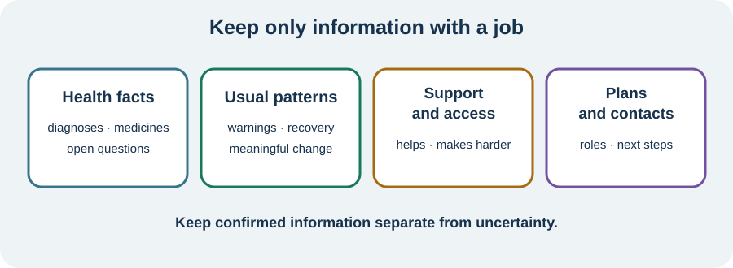

<!-- NAV-BREADCRUMB:START -->
[Home](../../../README.md) › [Course](../../README.md) › Part Six: Long-Term Management › [Module 22](README.md) › **Choose What Belongs in the Handbook**
<!-- NAV-BREADCRUMB:END -->

# Choose What Belongs in the Handbook

> **Working draft:** This page was automatically generated and is looking for [contributors and reviewers](https://fnd-education-project.github.io/FND-Education/).

You do not need to remember the whole course. Your handbook can hold the few things you want available on a difficult day.

## For the Person With FND

### Definition

A **Personal FND Handbook** is a short reference about your diagnoses, familiar patterns, needs, plans and choices. It supports memory and communication; it does not diagnose a symptom or replace your medical record.

*Illustration: collect a few decision-changing items under health facts, patterns, support and access, and plans and contacts.*

### If you read only one thing

Start with what another person needs to know to understand you or make a safer decision. Keep confirmed facts separate from open questions. Leave out detail that has no job.

### Four useful sections

1. **Health facts:** how FND was diagnosed; confirmed conditions; unresolved questions; medication list, allergies and important adverse responses.
2. **Usual patterns:** main symptoms or event types; familiar warnings; usual length and recovery; meaningful changes that need advice.
3. **Support and access:** mobility, sensory, speech, thinking or memory needs; equipment; what helps; what makes things harder; the role you want supporters to take.
4. **Plans and contacts:** everyday strategies; episode or setback plans; emergency criteria agreed with clinicians; current goals; care-team roles and contact routes.

You can keep a one-page summary at the front and detailed records elsewhere. Do not copy an uncertain theory into the “confirmed” section. Do not include a promise that a treatment will cure FND; there is no cure. A useful handbook can still support symptom relief, access, safer care and a better quality of life.

Research supports clear written information, individual assessment and coordinated care, but the complete handbook described here has not been tested as an FND treatment. It is an organizing tool, not a validated medical instrument. (*citations* [1](#citation-1), [2](#citation-2), [3](#citation-3))

### Community experiences for review

**Option 1 — little information to work from**

> “I was told next to nothing, given no expectations”

— One person's experience after diagnosis. [Read the public source](https://www.reddit.com/r/FND/comments/1c35psh/tips_for_navigating_the_nhs/).

**Option 2 — an individual plan**

> “we worked on an individualized treatment plan.”

— One person described private neuropsychology care; access and suitability vary. [Read the public source](https://www.reddit.com/r/FND/comments/11aerci/out_of_curiosity_have_any_of_you_actually_healed/).

### Questions

#### Which fact about you is most often missing when someone tries to help?

#### Which part of your experience is important to record as uncertain rather than force into an answer?

### One small thing you can do

Open a blank page and write only four headings: **health — patterns — access — plans**. Add one item under the easiest heading. A supporter may write while you choose the words. New or changed symptoms belong in clinical reassessment, not in self-diagnosis.

***
[For the Person With FND](#for-the-person-with-fnd) 
[For Family, Friends, and Other Supporters](#for-family-friends-and-other-supporters) 
[For Clinicians and the Care Team](#for-clinicians-and-the-care-team) 
[Research and Sources](#research-and-sources)
***

## For Family, Friends, and Other Supporters

Offer memory, typing or organizing help if wanted. Describe only what you actually observe and ask before adding it. The person decides what private information is included and shared.

Learn the sections you may need during familiar episodes. Do not use the handbook to monitor treatment, activity, emotions or compliance. It should reduce load, not transfer control.

***
[For the Person With FND](#for-the-person-with-fnd) 
[For Family, Friends, and Other Supporters](#for-family-friends-and-other-supporters) 
[For Clinicians and the Care Team](#for-clinicians-and-the-care-team) 
[Research and Sources](#research-and-sources)
***

## For Clinicians and the Care Team

### Research quotations for review

**Option 1 — Silva and Silva, 2026**

> “written informational resources”

**Option 2 — Nicholson et al., 2020**

> “individualised assessment and treatment”

*Figure 1 — Research quotations offered for editorial selection. (*citations* [1](#citation-1), [2](#citation-2))*

### Help make the record accurate and usable

Confirm the diagnostic label and positive basis, relevant comorbidity, current medication and observable reassessment criteria. Separate established findings, patient report, formulation and uncertainty. Name clinical responsibility and review routes.

Ask which details improve the patient's care and which create burden or risk. Provide accessible written summaries and invite factual correction. The handbook should complement, not replace, the health record, emergency assessment or direct communication. (*citations* [1](#citation-1), [2](#citation-2), [3](#citation-3))

***
[For the Person With FND](#for-the-person-with-fnd) 
[For Family, Friends, and Other Supporters](#for-family-friends-and-other-supporters) 
[For Clinicians and the Care Team](#for-clinicians-and-the-care-team) 
[Research and Sources](#research-and-sources)
***

<!-- NAV-CONTEXT:START -->
**Continue:** [Next page: Build a Short Safety and Communication Summary](02-building-using-and-reviewing-the-handbook.md)

**Navigate:** [Module overview](README.md) · [Course](../../README.md) · [Site Map](../../../SITEMAP.md)
<!-- NAV-CONTEXT:END -->

***

## Research and Sources

These sources support written communication, individual assessment and coordinated care. None tested this complete handbook as an intervention. (*citations* [1](#citation-1), [2](#citation-2), [3](#citation-3))

| Citation | Figure | Full citation |
|---|---|---|
| **[1]** | Figure 1 | Silva AF, Silva B. Diagnostic communication in functional neurological disorder: a systematic review and meta-analysis of patient acceptance and clinical outcomes. *Patient Education and Counseling*. 2026;152:109826. [FND-CIT-0083](../../../research/citation-index.md#fnd-cit-0083). [https://doi.org/10.1016/j.pec.2026.109826](https://doi.org/10.1016/j.pec.2026.109826) |
| **[2]** | Figure 1 | Nicholson C, Edwards MJ, Carson AJ, et al. Occupational therapy consensus recommendations for functional neurological disorder. *Journal of Neurology, Neurosurgery & Psychiatry*. 2020;91(10):1037–1045. [FND-CIT-0011](../../../research/citation-index.md#fnd-cit-0011). [https://doi.org/10.1136/jnnp-2019-322281](https://doi.org/10.1136/jnnp-2019-322281) |
| **[3]** | — | Lehn A, Petrie D, Palmer D, et al. Managing functional neurological disorder: treatment recommendations for health professionals in Australia. *BMJ Neurology Open*. 2025;7(1):e000970. [FND-CIT-0076](../../../research/citation-index.md#fnd-cit-0076). [https://doi.org/10.1136/bmjno-2024-000970](https://doi.org/10.1136/bmjno-2024-000970) |

This page still needs review by people with cognitive or communication symptoms, supporters, clinicians and health-information reviewers.

*Plain-language draft and research package prepared: September 9, 2026 · Clinical review pending*
