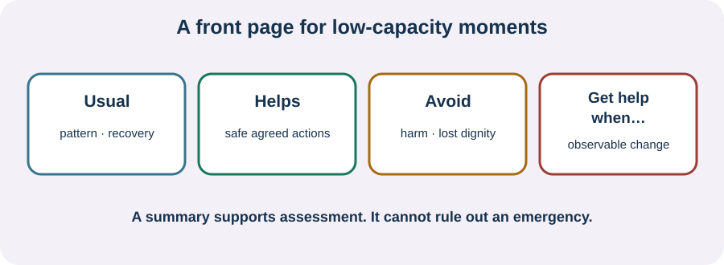

<!-- NAV-BREADCRUMB:START -->
[Home](../../../README.md) › [Course](../../README.md) › Part Six: Long-Term Management › [Module 22](README.md) › **Build a Short Safety and Communication Summary**
<!-- NAV-BREADCRUMB:END -->

# Build a Short Safety and Communication Summary

> **Working draft:** This page was automatically generated and is looking for [contributors and reviewers](https://fnd-education-project.github.io/FND-Education/).

The front page of your handbook should work when you cannot give a long history, remember details or speak in your usual way.

## For the Person With FND

### Definition

A **safety and communication summary** is a short page that tells another person what is usual, what helps, what to avoid and when the familiar plan no longer fits.

*Illustration: the page separates your usual pattern from helpful actions, actions to avoid and agreed reasons to seek help.*

### If you read only one thing

Write for the moment when another person has very little time. Use observable facts and direct instructions. Never let the summary say that all future symptoms are FND.

### A possible front page

**Who I am**

- name, preferred communication and emergency contact;
- important diagnoses, medicines, allergies and equipment.

**What is usual**

- one sentence for each familiar episode or symptom pattern;
- typical warning, length, recovery and support needed.

**What helps or harms**

- helpful positioning, quiet, communication, mobility or recovery support;
- actions that have caused injury, distress, unnecessary treatment or loss of dignity.

**When to get help**

- observable criteria agreed with clinicians;
- new, severe, injured, sustained or substantially changed symptoms;
- local emergency instructions.

If speech may be difficult, add a yes/no method, communication board, device or named supporter role. If you have more than one event type, keep them separate. If epilepsy or another condition coexists, the plan must distinguish what clinicians have actually established.

A card cannot rule out an emergency. It should support rapid, proportionate assessment—not tell clinicians to ignore change. Research and guidance emphasize shared planning, coexisting conditions and avoiding both under-treatment and iatrogenic harm. (*citations* [1](#citation-1), [2](#citation-2), [3](#citation-3))

### Community experiences for review

**Option 1 — preserving safety during an episode**

> “During seizures he makes sure I am safe and not about to smack into something or fall.”

— One person's description of a fiancé's role; individual episode plans differ. [Read the public source](https://www.reddit.com/r/FND/comments/1k8is0m/support_for_my_wife/).

**Option 2 — agreeing communication before distress**

> “One thing that really helps us is discussing ground rules for conflict when we’re not actively IN it.”

— A supporter's account of planning around seizures and speech loss. [Read the public source](https://www.reddit.com/r/FND/comments/1g8ebg3/i_need_advice/).

### Questions

#### If you could communicate only one safety need during a difficult episode, what would it be?

#### Which action from other people makes you feel safer, and which makes the situation harder?

### One small thing you can do

Write one line beginning **“What is usual for me is…”** and one beginning **“Get more help if…”** Ask an appropriate clinician to check the second line. Do not wait for this summary if you need urgent help now.

***
[For the Person With FND](#for-the-person-with-fnd) 
[For Family, Friends, and Other Supporters](#for-family-friends-and-other-supporters) 
[For Clinicians and the Care Team](#for-clinicians-and-the-care-team) 
[Research and Sources](#research-and-sources)
***

## For Family, Friends, and Other Supporters

Practise finding and reading the page while things are calm. Ask which instructions belong to you and which require a clinician or emergency service. Keep the person involved whenever they can decide.

Follow the plan without treating it as permission to restrain, force, test or dismiss. If an event is substantially different or the person is in danger, seek appropriate help. Tell responders what you observed rather than offering a diagnosis.

***
[For the Person With FND](#for-the-person-with-fnd) 
[For Family, Friends, and Other Supporters](#for-family-friends-and-other-supporters) 
[For Clinicians and the Care Team](#for-clinicians-and-the-care-team) 
[Research and Sources](#research-and-sources)
***

## For Clinicians and the Care Team

### Research quotations for review

**Option 1 — Tolchin et al., 2026**

> “engage in shared decision making regarding the treatment plan”

**Option 2 — Mcloughlin et al., 2025**

> “A balanced approach is needed not to over or under-investigate new symptoms on their own merits.”

*Figure 1 — Research quotations offered for editorial selection. (*citations* [1](#citation-1), [2](#citation-2))*

### Make instructions specific and bounded

Co-write observable descriptions of familiar events, safe responses, contraindicated or previously harmful actions, communication access and escalation criteria. State the positive diagnostic basis and coexisting diagnoses without implying that the card adjudicates a changed presentation.

The AAN guideline applies specifically to functional seizures; its shared-decision principle does not validate a universal all-FND emergency card. Review local scope, consent and emergency practice. Give the patient an accessible copy and identify who will update it. (*citations* [1](#citation-1), [2](#citation-2), [3](#citation-3))

***
[For the Person With FND](#for-the-person-with-fnd) 
[For Family, Friends, and Other Supporters](#for-family-friends-and-other-supporters) 
[For Clinicians and the Care Team](#for-clinicians-and-the-care-team) 
[Research and Sources](#research-and-sources)
***

<!-- NAV-CONTEXT:START -->
**Continue:** [Next page: Use, Protect, and Update the Handbook](03-using-protecting-and-updating-the-handbook.md)

**Navigate:** [← Previous page](01-what-belongs-in-the-personal-fnd-handbook.md) · [Module overview](README.md) · [Course](../../README.md)
<!-- NAV-CONTEXT:END -->

***

## Research and Sources

The functional-seizure guideline supports shared planning for that presentation; the other sources support balanced assessment and written information. None validates one summary for every FND presentation or jurisdiction. (*citations* [1](#citation-1), [2](#citation-2), [3](#citation-3))

| Citation | Figure | Full citation |
|---|---|---|
| **[1]** | Figure 1 | Tolchin B, Goldstein LH, Reuber M, Stone J, Perez DL, LaFrance WC Jr, et al. Management of Functional Seizures Practice Guideline Executive Summary: Report of the AAN Guidelines Subcommittee. *Neurology*. 2026;106(1):e214466. [FND-CIT-0010](../../../research/citation-index.md#fnd-cit-0010). [https://doi.org/10.1212/WNL.0000000000214466](https://doi.org/10.1212/WNL.0000000000214466) |
| **[2]** | Figure 1 | Mcloughlin C, Lee WH, Carson A, Stone J. Iatrogenic harm in functional neurological disorder. *Brain*. 2025;148(1):27–38. [FND-CIT-0069](../../../research/citation-index.md#fnd-cit-0069). [https://doi.org/10.1093/brain/awae283](https://doi.org/10.1093/brain/awae283) |
| **[3]** | — | Silva AF, Silva B. Diagnostic communication in functional neurological disorder: a systematic review and meta-analysis of patient acceptance and clinical outcomes. *Patient Education and Counseling*. 2026;152:109826. [FND-CIT-0083](../../../research/citation-index.md#fnd-cit-0083). [https://doi.org/10.1016/j.pec.2026.109826](https://doi.org/10.1016/j.pec.2026.109826) |

This page still needs review by people with different FND presentations, emergency clinicians, communication specialists, supporters and jurisdiction-specific reviewers.

*Plain-language draft and research package prepared: September 9, 2026 · Clinical review pending*
