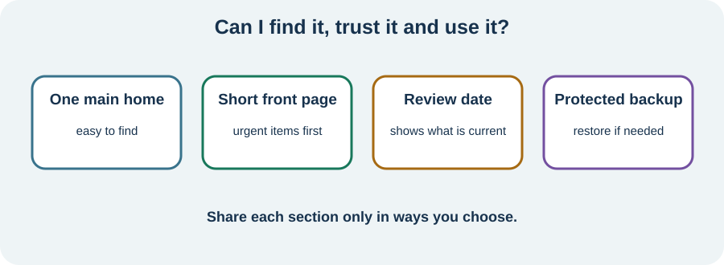

<!-- NAV-BREADCRUMB:START -->
[Home](../../../README.md) › [Course](../../README.md) › Part Six: Long-Term Management › [Module 22](README.md) › **Use, Protect, and Update the Handbook**
<!-- NAV-BREADCRUMB:END -->

# Use, Protect, and Update the Handbook

> **Working draft:** This page was automatically generated and is looking for [contributors and reviewers](https://fnd-education-project.github.io/FND-Education/).

A handbook works only if you can find it, trust it and understand which version is current.

## For the Person With FND

### Definition

A **handbook review** is a short check that the information is still correct, accessible and shared only in ways you want.

*Illustration: choose one main home, keep the front page short, date each review and protect a backup.*

### If you read only one thing

Test the handbook in ordinary life. Can you find the right page? Can another person understand it? Is the information current? If not, simplify before adding more.

### Make it usable

- Choose one main paper folder, phone note, document or accessible app.
- Put the shortest, most urgent page first.
- Use large text, plain headings, icons or audio only when they improve access.
- Keep a backup you can restore.
- Put **last reviewed** on each time-sensitive page.

Ask one trusted person to find a specific instruction without your help. Their confusion is information about the layout, not a test you failed.

### Protect choice and privacy

Decide who may see each part. A supporter may need the episode plan but not private history. An employer may need functional information but not a complete medical narrative. Laws and record systems differ, so obtain local advice for formal sharing.

Do not put unencrypted sensitive files in a place you would not normally trust. Balance protection with access in an emergency. The right answer depends on your risks, technology and support.

Review after a new diagnosis, medication change, important setback, change in support, or when instructions no longer fit. Routine checks can be brief. Research does not show that more tracking is always better, and no handbook score can measure effort. (*citations* [1](#citation-1), [2](#citation-2), [3](#citation-3))

### Community experiences for review

**Option 1 — memory support is sometimes necessary**

> “Currently I can barely take care of myself ... My partner has to remind me.”

— One person's account of memory problems and support needs. [Read the public source](https://www.reddit.com/r/FND/comments/13rzn9o/memory_issues/).

**Option 2 — time can be hard to reconstruct**

> “I can’t really tell the difference between whether something happened two weeks ago or four months ago.”

— One person's description of difficulty placing events in time. [Read the public source](https://www.reddit.com/r/FND/comments/1mnw4fd/dae_have_functional_cognitive_disorder/).

### Questions

#### When your capacity is lowest, where would you actually look for important information?

#### Which part of your handbook should remain private unless you choose to share it?

### One small thing you can do

Add **last reviewed: [date]** to the front page. Then remove one item that is outdated or has no clear use. If digital security is difficult, ask a trusted person or local service for help without giving them more access than needed.

***
[For the Person With FND](#for-the-person-with-fnd) 
[For Family, Friends, and Other Supporters](#for-family-friends-and-other-supporters) 
[For Clinicians and the Care Team](#for-clinicians-and-the-care-team) 
[Research and Sources](#research-and-sources)
***

## For Family, Friends, and Other Supporters

Know where the agreed version is and how to open it. Offer to maintain formatting or backups, but let the person approve content and sharing. Do not keep a secret “real” version about them.

If you notice a plan no longer fits, ask for a review. Do not edit medical instructions yourself or make access conditional on following your preferences.

***
[For the Person With FND](#for-the-person-with-fnd) 
[For Family, Friends, and Other Supporters](#for-family-friends-and-other-supporters) 
[For Clinicians and the Care Team](#for-clinicians-and-the-care-team) 
[Research and Sources](#research-and-sources)
***

## For Clinicians and the Care Team

### Research quotations for review

**Option 1 — Pick et al., 2020**

> “few well-validated FND-specific outcome measures”

**Option 2 — Lehn et al., 2025**

> “person-centred treatment”

*Figure 1 — Research quotations offered for editorial selection. (*citations* [1](#citation-1), [2](#citation-2))*

### Review usefulness, not compliance

Check accuracy, observable escalation criteria, accessibility and named responsibility. Ask whether the record helped in an appointment or episode and whether it introduced burden, privacy risk or misunderstanding.

A personal log or handbook is not a validated outcome measure and should not be used to judge engagement. Offer corrections and updated clinical summaries in an accessible format. Continue to assess changed presentations directly rather than allowing old wording to become permanent diagnostic closure. (*citations* [1](#citation-1), [2](#citation-2), [3](#citation-3))

***
[For the Person With FND](#for-the-person-with-fnd) 
[For Family, Friends, and Other Supporters](#for-family-friends-and-other-supporters) 
[For Clinicians and the Care Team](#for-clinicians-and-the-care-team) 
[Research and Sources](#research-and-sources)
***

<!-- NAV-CONTEXT:START -->
**Continue:** [Next module: Review Progress and Choose Next Steps](../module-23-reviewing-progress/README.md)

**Navigate:** [← Previous page](02-building-using-and-reviewing-the-handbook.md) · [Module overview](README.md) · [Course](../../README.md)
<!-- NAV-CONTEXT:END -->

***

## Research and Sources

These sources support patient-centred care, written planning and cautious outcome measurement. They do not validate this handbook or establish one privacy method. (*citations* [1](#citation-1), [2](#citation-2), [3](#citation-3))

| Citation | Figure | Full citation |
|---|---|---|
| **[1]** | Figure 1 | Pick S, Anderson DG, Asadi-Pooya AA, et al. Outcome measurement in functional neurological disorder: a systematic review and recommendations. *Journal of Neurology, Neurosurgery & Psychiatry*. 2020;91(6):638–649. [FND-CIT-0067](../../../research/citation-index.md#fnd-cit-0067). [https://doi.org/10.1136/jnnp-2019-322180](https://doi.org/10.1136/jnnp-2019-322180) |
| **[2]** | Figure 1 | Lehn A, Petrie D, Palmer D, et al. Managing functional neurological disorder: treatment recommendations for health professionals in Australia. *BMJ Neurology Open*. 2025;7(1):e000970. [FND-CIT-0076](../../../research/citation-index.md#fnd-cit-0076). [https://doi.org/10.1136/bmjno-2024-000970](https://doi.org/10.1136/bmjno-2024-000970) |
| **[3]** | — | Silva AF, Silva B. Diagnostic communication in functional neurological disorder: a systematic review and meta-analysis of patient acceptance and clinical outcomes. *Patient Education and Counseling*. 2026;152:109826. [FND-CIT-0083](../../../research/citation-index.md#fnd-cit-0083). [https://doi.org/10.1016/j.pec.2026.109826](https://doi.org/10.1016/j.pec.2026.109826) |

This page still needs review by people who use accessible records, privacy and health-information specialists, supporters and clinicians.

*Plain-language draft and research package prepared: September 9, 2026 · Clinical review pending*
