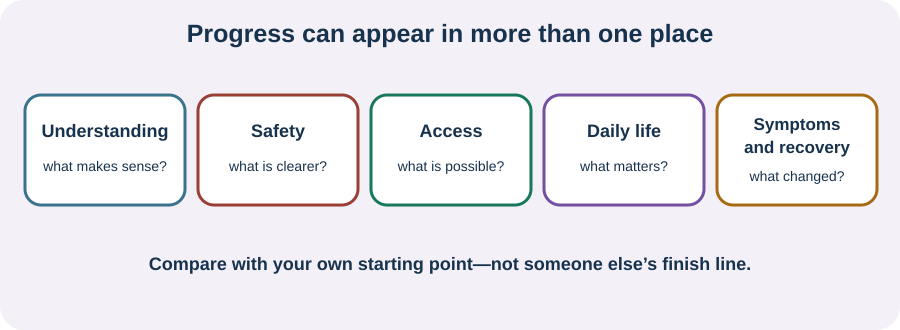

<!-- NAV-BREADCRUMB:START -->
[Home](../../../README.md) › [Course](../../README.md) › Part Six: Long-Term Management › [Module 23](README.md) › **Recognize Progress Across More Than Symptoms**
<!-- NAV-BREADCRUMB:END -->

# Recognize Progress Across More Than Symptoms

> **Working draft:** This page was automatically generated and is looking for [contributors and reviewers](https://fnd-education-project.github.io/FND-Education/).

Symptoms matter. They are not the only part of life that matters or the only place change can happen.

## For the Person With FND

### Definition

A **progress review** compares what matters to you now with your own earlier starting point. It can include symptoms, understanding, safety, access, function, participation and quality of life.

*Illustration: look across several areas; a symptom score is one source of information, not the whole result.*

### If you read only one thing

Ask what is different, what is unchanged and what became harder. Progress can be uneven. A gain in safety, understanding, independence or connection is real even when symptoms continue. Worsening is important information, not evidence that you did not try.

### Five places to look

- **Understanding:** Can you explain the diagnosis and uncertainty in words that make sense to you?
- **Safety:** Do you and your supporters know what to do during familiar episodes and meaningful change?
- **Access:** Are communication, sensory, mobility, memory and daily-living needs better supported?
- **Daily life:** Has anything changed in independence, relationships, rest, care, learning, work, community or enjoyment?
- **Symptoms and recovery:** Are frequency, severity, duration, injury or recovery time useful to compare?

Use only measures that help a decision. A short note from a typical week may be more useful than daily scoring. Fluctuation can make one measurement misleading. Other conditions, treatment effects, changed circumstances and what you now notice can also affect the comparison.

Researchers have found few well-validated FND-specific outcome measures. A 2025 qualitative study reported that patients, caregivers and clinicians wanted several outcome areas, including subjective experience, daily life and quality of life. These findings support a broader review but do not create one correct definition of recovery. (*citations* [1](#citation-1), [2](#citation-2))

### Community experiences for review

**Option 1 — access can widen life**

> “My mobility aids have been incredibly helpful and enable me to live life more fully.”

— One person's account; equipment needs and effects vary. [Read the public source](https://www.reddit.com/r/FND/comments/106utzh/advice_needed_considering_using_mobility_aid_for/).

**Option 2 — the goal can change**

> “therapy has switched to helping [me] function as someone who is paralyzed”

— One person described greater confidence and return to living after the focus changed. This is not a prediction for others. [Read the public source](https://www.reddit.com/r/FND/comments/1kchl1l/how_to_get_out_of_paralysis_epsiode/).

### Questions

#### Which change in your life matters to you even if another person might overlook it?

#### What became harder or remained unmet and deserves to be named without turning it into failure?

### One small thing you can do

Choose only one area from the list. Finish three lines: **before — now — what I need.** A lower-demand version is to choose three words. Stop if tracking becomes obsessive, shaming or more burdensome than useful.

***
[For the Person With FND](#for-the-person-with-fnd) 
[For Family, Friends, and Other Supporters](#for-family-friends-and-other-supporters) 
[For Clinicians and the Care Team](#for-clinicians-and-the-care-team) 
[Research and Sources](#research-and-sources)
***

## For Family, Friends, and Other Supporters

Ask what the person counts as progress. Do not replace their priorities with walking, paid work, fewer visible symptoms or less need for you. Accessibility and support can improve life without being evidence of surrender.

Review your own wellbeing and role: confidence, workload, health, boundaries and whether help is wanted, unavailable or unsustainable. Name strain without blaming the person.

***
[For the Person With FND](#for-the-person-with-fnd) 
[For Family, Friends, and Other Supporters](#for-family-friends-and-other-supporters) 
[For Clinicians and the Care Team](#for-clinicians-and-the-care-team) 
[Research and Sources](#research-and-sources)
***

## For Clinicians and the Care Team

### Research quotations for review

**Option 1 — Rutten et al., 2025**

> “all believed that the patient’s subjective experience should be central.”

**Option 2 — Pick et al., 2020**

> “few well-validated FND-specific outcome measures”

*Figure 1 — Research quotations offered for editorial selection. (*citations* [1](#citation-1), [2](#citation-2))*

### Measure what can improve a decision

Begin with patient-defined priorities and baseline. Combine relevant symptom, function, participation, safety, quality-of-life and adverse-effect information. Distinguish self-report, supporter observation, clinical assessment and performance testing.

No single scale establishes effort, treatment fit or prognosis. Consider measurement burden, fluctuation, floor or ceiling effects and response shift. Record non-response, harm and access barriers as carefully as improvement. (*citations* [1](#citation-1), [2](#citation-2))

***
[For the Person With FND](#for-the-person-with-fnd) 
[For Family, Friends, and Other Supporters](#for-family-friends-and-other-supporters) 
[For Clinicians and the Care Team](#for-clinicians-and-the-care-team) 
[Research and Sources](#research-and-sources)
***

<!-- NAV-CONTEXT:START -->
**Continue:** [Next page: Choose Next Steps and Finish the Course](02-choosing-next-steps-and-finishing-the-course.md)

**Navigate:** [Module overview](README.md) · [Course](../../README.md) · [Site Map](../../../SITEMAP.md)
<!-- NAV-CONTEXT:END -->

***

## Research and Sources

The systematic review found major measurement limitations; the qualitative study adds stakeholder priorities from a selected UK sample. Neither creates a score that defines personal success. (*citations* [1](#citation-1), [2](#citation-2))

| Citation | Figure | Full citation |
|---|---|---|
| **[1]** | Figure 1 | Rutten S, Bradley-Westguard A, Nicholson TR, et al. Outcome measurement in functional neurological disorder: a qualitative study on the views of patients, caregivers and healthcare professionals. *Journal of Neurology*. 2025;272:189. [FND-CIT-0012](../../../research/citation-index.md#fnd-cit-0012). [https://doi.org/10.1007/s00415-025-12912-9](https://doi.org/10.1007/s00415-025-12912-9) |
| **[2]** | Figure 1 | Pick S, Anderson DG, Asadi-Pooya AA, et al. Outcome measurement in functional neurological disorder: a systematic review and recommendations. *Journal of Neurology, Neurosurgery & Psychiatry*. 2020;91(6):638–649. [FND-CIT-0067](../../../research/citation-index.md#fnd-cit-0067). [https://doi.org/10.1136/jnnp-2019-322180](https://doi.org/10.1136/jnnp-2019-322180) |

This page still needs review by people with different goals and levels of disability, supporters, clinicians and outcome-measure researchers.

*Plain-language draft and research package prepared: September 9, 2026 · Clinical review pending*
