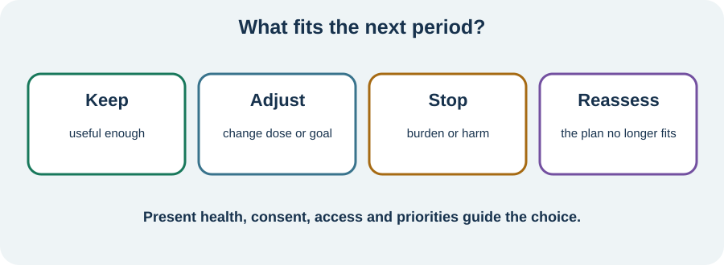

<!-- NAV-BREADCRUMB:START -->
[Home](../../../README.md) › [Course](../../README.md) › Part Six: Long-Term Management › [Module 23](README.md) › **Choose Next Steps and Finish the Course**
<!-- NAV-BREADCRUMB:END -->

# Choose Next Steps and Finish the Course

> **Working draft:** This page was automatically generated and is looking for [contributors and reviewers](https://fnd-education-project.github.io/FND-Education/).

Finishing the course does not require finishing FND. It means choosing what, if anything, is useful to carry forward.

## For the Person With FND

### Definition

A **next-step plan** names what to keep, change, stop or reassess during the next period. It can include treatment, practical support, accessibility, relationships, safety or rest.

*Illustration: your next step may be to keep, adjust, stop or reassess something; none is automatically the “good patient” choice.*

### If you read only one thing

Choose at most one or two priorities. A next step should fit your present health, access, consent and capacity. Continuing care is worthwhile even when improvement is limited or not possible now.

### Four possible decisions

- **Keep:** a strategy, aid, treatment or support is useful enough to continue.
- **Adjust:** the idea is worthwhile but the dose, setting, goal, access or help needs to change.
- **Stop:** benefit is absent, burden or harm is too high, consent has changed, or another priority matters more.
- **Reassess:** the diagnosis, symptom pattern, comorbidity, medication, injury, risk or treatment match needs another look.

For each choice, write who will do what and when it will be reviewed. “No action for now” can be an active decision. So can comfort, accessibility, symptom relief, disability support, supporter wellbeing or preserving one valued part of life.

FND has no cure. Some people improve substantially; some have persistent, recurrent or worsening disability; many have mixed outcomes. Research groups cannot predict one person's future. In a 2025 meta-analysis, longer symptom duration was linked with modestly smaller change in some domains but did not remove the possibility of meaningful gains. This must not be used to deny care or promise recovery. (*citations* [1](#citation-1), [2](#citation-2), [3](#citation-3))

### Community experiences for review

**Option 1 — reported benefit**

> “Physical and occupational therapy helped me a lot.”

— One person’s experience; the contribution of each therapy was not separated. [Read the public source](https://www.reddit.com/r/FND/comments/q3hz2r/im_so_embarrassed/).

**Option 2 — no reported movement benefit**

> “In my case PT did not help ... I went for 6 months with no progress.”

— One person's account in which one symptom changed as another worsened. [Read the public source](https://www.reddit.com/r/FND/comments/18gbf7f/how_did_you_regain_your_ability_to_walk/).

### Questions

#### What do you want the next part of care or daily life to protect—not only improve?

#### Which one thing would you keep, adjust, stop or ask someone to reassess?

### One small thing you can do

Write one sentence: **“For the next month, my priority is ___, and the support I need is ___.”** Choose another review period if a month does not fit. Add it to your handbook or ask someone to help you communicate it.

***
[For the Person With FND](#for-the-person-with-fnd) 
[For Family, Friends, and Other Supporters](#for-family-friends-and-other-supporters) 
[For Clinicians and the Care Team](#for-clinicians-and-the-care-team) 
[Research and Sources](#research-and-sources)
***

## For Family, Friends, and Other Supporters

Ask what role, if any, the person wants you to carry forward. Say what you can do safely and sustainably. A boundary is not abandonment, and accepting help is not failure.

Do not make visible symptom reduction, walking, independence from aids or employment the price of encouragement. Help arrange reassessment when the plan no longer fits, and protect the relationship beyond the care role.

***
[For the Person With FND](#for-the-person-with-fnd) 
[For Family, Friends, and Other Supporters](#for-family-friends-and-other-supporters) 
[For Clinicians and the Care Team](#for-clinicians-and-the-care-team) 
[Research and Sources](#research-and-sources)
***

## For Clinicians and the Care Team

### Research quotations for review

**Option 1 — Thomas et al., 2025**

> “did not negate meaningful gains”

**Option 2 — Rutten et al., 2025**

> “the patient’s subjective experience should be central.”

*Figure 1 — Research quotations offered for editorial selection. (*citations* [1](#citation-1), [2](#citation-2))*

### End a course, not continuity of care

Review benefits, adverse effects, non-response, treatment burden, access barriers, comorbidity and changing goals. Agree whether each intervention should continue, change, stop or be reassessed, and document responsibility.

Avoid equating attendance or symptom change with effort. Group-level chronicity findings do not justify therapeutic pessimism, while “neuroplasticity” does not justify a cure promise. When restorative treatment is limited or unwanted, continue validation, symptom management, accessibility, safety, participation, supporter support and an agreed route back to review. (*citations* [1](#citation-1), [2](#citation-2), [3](#citation-3))

***
[For the Person With FND](#for-the-person-with-fnd) 
[For Family, Friends, and Other Supporters](#for-family-friends-and-other-supporters) 
[For Clinicians and the Care Team](#for-clinicians-and-the-care-team) 
[Research and Sources](#research-and-sources)
***

<!-- NAV-CONTEXT:START -->
**Continue:** [Return to the course index](../../README.md)

**Navigate:** [← Previous page](01-measuring-progress-and-choosing-next-steps.md) · [Module overview](README.md) · [Home](../../../README.md) · [Site Map](../../../SITEMAP.md)
<!-- NAV-CONTEXT:END -->

***

## Research and Sources

These sources support broader outcomes, flexible goals and continuing care. The meta-analysis reports averages across varied studies; it cannot predict one person's response or define a required next step. (*citations* [1](#citation-1), [2](#citation-2), [3](#citation-3))

| Citation | Figure | Full citation |
|---|---|---|
| **[1]** | Figure 1 | Thomas ST, Thomas ET, Schembri E, Lehn AC, Palmer DDG. Treatment outcomes in functional neurological disorder: a systematic review and meta-analysis exploring the influence of symptom chronicity. *BMJ Neurology Open*. 2025;7(2):e001150. [FND-CIT-0051](../../../research/citation-index.md#fnd-cit-0051). [https://doi.org/10.1136/bmjno-2025-001150](https://doi.org/10.1136/bmjno-2025-001150) |
| **[2]** | Figure 1 | Rutten S, Bradley-Westguard A, Nicholson TR, et al. Outcome measurement in functional neurological disorder: a qualitative study on the views of patients, caregivers and healthcare professionals. *Journal of Neurology*. 2025;272:189. [FND-CIT-0012](../../../research/citation-index.md#fnd-cit-0012). [https://doi.org/10.1007/s00415-025-12912-9](https://doi.org/10.1007/s00415-025-12912-9) |
| **[3]** | — | Nicholson C, Edwards MJ, Carson AJ, et al. Occupational therapy consensus recommendations for functional neurological disorder. *Journal of Neurology, Neurosurgery & Psychiatry*. 2020;91(10):1037–1045. [FND-CIT-0011](../../../research/citation-index.md#fnd-cit-0011). [https://doi.org/10.1136/jnnp-2019-322281](https://doi.org/10.1136/jnnp-2019-322281) |

This page still needs review by people with persistent, recurrent and improving FND, supporters, clinicians and disability advocates.

*Plain-language draft and research package prepared: September 9, 2026 · Clinical review pending*
